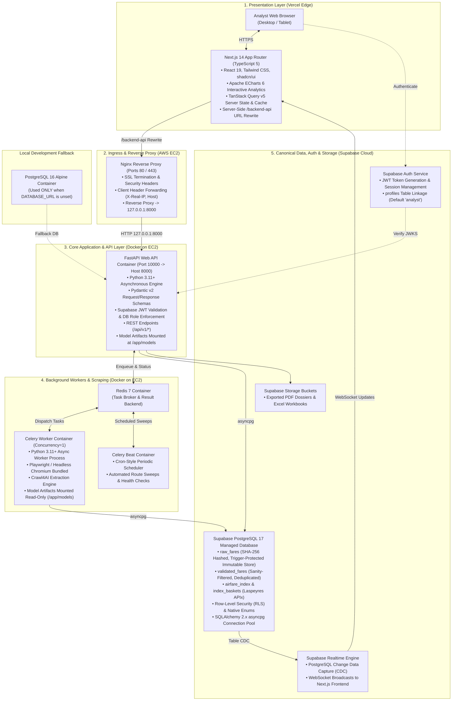
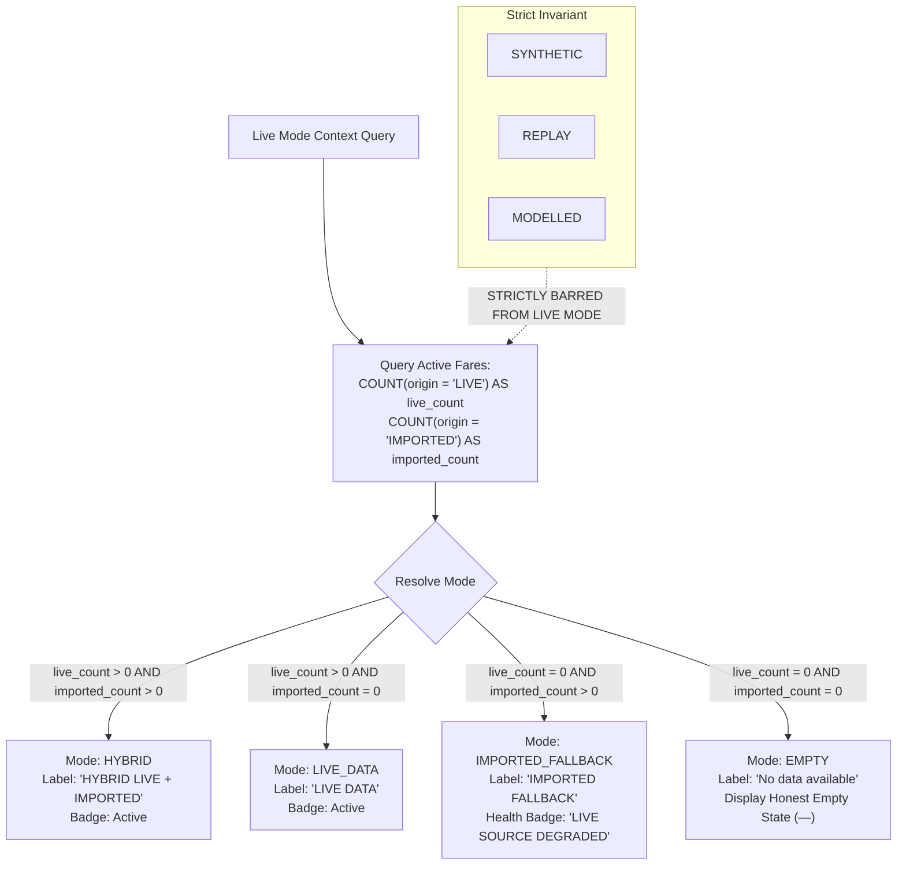

# VAYANTARA — Airfare Intelligence for Economic Measurement

> **Institutional prototype for real-time domestic airfare indexation, market surveillance, and macroeconomic measurement in India.**  
> *(Formerly developed under the project name **AirPulse**, now officially renamed **VAYANTARA**.)*

---

## 1. Executive Summary & Project Identity

**VAYANTARA** (originally developed under the project code name **AirPulse**) is the unified real-time airfare intelligence, market surveillance, and price indexation platform for India.

> [!NOTE]
> **Project Renaming Notice:**  
> **AirPulse and VAYANTARA are the same platform.** The project was originally conceived and built under the code name **AirPulse** and has been formally renamed to **VAYANTARA**.  
> While the public identity, analytical interface, and documentation reflect **VAYANTARA**, certain technical artifacts—such as the backend service directory (`airpulse-api/`), internal Docker container tags, worker names, and export filenames—retain the legacy `airpulse` identifier for codebase stability and backward compatibility.

```
┌───────────────────────────────────────────────────────────────────────────────────────────┐
│                                         VAYANTARA                                         │
│                      Airfare Intelligence for Economic Measurement                        │
│                         (Formerly Developed as Project AirPulse)                          │
├───────────────────────────────────────────────────────────────────────────────────────────┤
│  • Public Mission & Overview Portal (/about)                                              │
│  • Real-Time Automated Web Acquisition (Crawl4AI & Playwright Chromium)                   │
│  • Canonical Normalization & Sanity Validation (Bounds Checks & SHA-256 Custody Hash)    │
│  • Stratified Booking-Window Advance Purchase Indicators (T+1 to T+45)                   │
│  • Pure Statistical Index Engine (Chained Laspeyres APIx, Base = 100)                     │
│  • Decoupled ML Observational QA (FareGuard XGBoost, PriceGuard Isolation Forest, SHAP)   │
│  • Market-Wide Price Shock Consensus Surveillance                                         │
│  • Audit-Grade Dossiers & Context-Aware Reproducible Exports (PDF, CSV, XLSX)             │
└───────────────────────────────────────────────────────────────────────────────────────────┘
```

The public-facing VAYANTARA web experience features a dedicated `/about` portal with a branded hero section and navigation bar, articulating the bridge between microeconomic airline yield algorithms and macroeconomic price indexation.

---

## 2. Problem Statement & Research Scope

* **Smart India Hackathon Problem ID**: **SIH26056**
* **Target Institution**: **Ministry of Statistics & Programme Implementation (MoSPI)** / **Data Informatics & Innovation Division (DIID)**
* **Category & Domain**: **Software / Smart Automation**

### Problem Context
Modern airline commercial pricing relies on high-frequency, dynamic yield-management algorithms. Fares fluctuate continuously based on advance-booking horizons, real-time demand signals, load factors, and competitor moves. Traditional consumer price collection methods relying on periodic manual surveys fail to capture this intra-month volatility.

The objective of SIH26056 is the **development of a real-time Airfare Price Index for India through automated collection of airline and Online Travel Aggregator (OTA) fare data to augment CPI-related airfare measurement.**

### Research Status & Scope Boundaries
> [!IMPORTANT]
> **Prototype & Research Implementation Notice:**  
> * **VAYANTARA** (formerly AirPulse) constitutes a **research prototype** developed for the Smart India Hackathon.
> * The **Airfare Price Index (APIx)** is a statistical research index designed to evaluate high-frequency price relatives; **it is not an official Consumer Price Index (CPI) release**.
> * Formal adoption for official national statistics requires MoSPI Price Statistics Division (PSD) review, official passenger expenditure weights, and verified multi-year baseline calibration.

---

## 3. What VAYANTARA Does

1. **Ethical Automated Web Acquisition**: Gathers economy-class domestic airfare quotes across monitored city pairs using browser automation under bounded concurrency and strict access-monitoring guardrails.
2. **Deterministic Normalization & Sanity Validation**: Converts disparate vendor payloads into canonical schemas while filtering physically corrupt observations (e.g., negative fares, inverted taxes, identical origin/destination).
3. **Advance Booking-Horizon Stratification**: Partitions quotes into standardized advance-purchase windows (`T+1`, `T+7`, `T+15`, `T+30`, `T+45`) to isolate structural dynamic pricing from baseline inflation.
4. **Independent Statistical Indexation (APIx)**: Computes a chained Laspeyres price-relative index ($Base = 100$) derived strictly from observed market fares, paired with a composite Coverage Quality Metric ($Q$).
5. **Decoupled ML Quality Assurance**:
   * **FareGuard**: Gradient-boosted regression (XGBoost) estimating expected fares to establish statistical baselines.
   * **PriceGuard**: Multivariate Isolation Forest detecting anomalous quotes without modifying the index.
   * **Selective TreeSHAP**: Evaluates feature attributions in rupee terms exclusively for anomalies to provide model interpretability.
6. **Confirmed Market Shock Surveillance**: Detects multi-source price surges to distinguish genuine economic shocks from individual outlier noise.
7. **Auditable Chain of Custody**: Persists SHA-256 payload hashes, run identifiers, collector versions, and immutable raw records protected by database triggers.

---

## 4. Key USPs — The Four Pillars

```
┌──────────────────────┬──────────────────────┬──────────────────────┬──────────────────────┐
│        TRUST         │      RESILIENCE      │     INTELLIGENCE     │STATISTICAL INTEGRITY │
├──────────────────────┼──────────────────────┼──────────────────────┼──────────────────────┤
│ • SHA-256 Hashes     │ • Hybrid LIVE +      │ • FareGuard Expected │ • APIx Independent   │
│ • Immutable Raw Log  │   IMPORTED Fallback  │   Fares (XGBoost)    │   of ML Predictions  │
│ • Full Custody Chain │ • Zero Synthetic     │ • PriceGuard Anomaly │ • Observed Fares Only│
│ • Explicit Origin    │   Leakage in Live    │   (Isolation Forest) │ • Stratified Windows │
│   Labels             │ • Decoupled Engine   │ • Selective TreeSHAP │ • Prototype Weights  │
└──────────────────────┴──────────────────────┴──────────────────────┴──────────────────────┘
```

* **Pillar 1: TRUST (Cryptographic Provenance)**  
  Every quote is fingerprinted with SHA-256 upon reception and recorded in an append-only PostgreSQL table protected by a trigger preventing `UPDATE` or `DELETE` operations. Complete custody chains link observations to collector engines, timestamps, run IDs, and source URLs.
* **Pillar 2: RESILIENCE (Graceful Degradation)**  
  A strict Live Mode context resolver switches transparently between `LIVE`, `HYBRID`, and `IMPORTED_FALLBACK`. If web sources become degraded, verified historical imports keep analytics operational. Synthetic or replay data is never permitted to leak into Live Mode.
* **Pillar 3: INTELLIGENCE (Observational ML & Explainability)**  
  FareGuard estimates baseline price expectations, while PriceGuard identifies multi-dimensional anomalies. Selective TreeSHAP quantifies feature drivers in rupees without making causal claims about airline pricing strategy.
* **Pillar 4: STATISTICAL INTEGRITY (Pure Mathematical Index)**  
  The Airfare Price Index (APIx) is computed strictly from verified, observed market quotes. ML predictions are never used to impute missing observations or adjust index points.

---

## 5. System Architecture

The platform uses a decoupled, multi-tier topology separating presentation, reverse proxy ingress, core REST microservices, asynchronous worker tasks, and managed cloud persistence.



### Infrastructure Summary
* **Presentation**: Next.js 14 App Router hosted on **Vercel**, using server-side URL rewrites (`/backend-api/:path*`) to shield backend endpoints.
* **Compute Host**: **AWS EC2** (`t3.small`, Ubuntu 24.04 LTS) executing containerized FastAPI, Celery worker, Celery Beat, and Redis under Docker Compose.
* **Ingress**: Host **Nginx** reverse proxy handling incoming traffic and proxying to `127.0.0.1:8000`.
* **Database & Auth**: Managed **Supabase Cloud** (PostgreSQL 17 with Row-Level Security, JWT Auth, and Realtime CDC).
* **Isolation**: Redis and database ports are bound to loopback/internal bridge networks and remain unexposed to public security groups.

---

## 6. End-to-End Data Flow

The lifecycle of an observation flows through distinct stages. A fundamental system invariant governs this architecture: **Collection is NOT ingestion. Staged fares cannot affect downstream analytics until explicitly ingested.**

```mermaid
flowchart TD
    subgraph S1["1. Live Scraping & Bounded Acquisition"]
        Req["SearchRequest Input\n(Origin, Destination, Departure Date, Cabin='economy')"]
        PreCheck{"Pre-Flight Check:\nrobots.txt & Policy"}
        Req --> PreCheck
        PreCheck -- Disallowed --> StopPol["Status: SKIPPED_POLICY\n(Abort Execution)"]
        PreCheck -- Allowed --> BrowserEng["Crawl4AI / Playwright\n(Headless Chromium, Concurrency=1)"]
        BrowserEng --> BarrierCheck{"Restriction Detected?\n(403 / 429 / CAPTCHA)"}
        BarrierCheck -- Yes --> StopHalt["Status: BLOCKED / CAPTCHA_DETECTED\n(Stop and Report, Zero Evasion)"]
        BarrierCheck -- No --> ExtCards["Extract Public Flight Cards\n(Price, Taxes, Carrier, Flight No)"]
    end

    subgraph S2["2. Staging Before Ingestion"]
        ExtCards --> Envelope["Wrap in Raw Envelope\n(UUID, Run ID, Timestamp, SHA-256 Hash)"]
        Envelope --> StagedStore["Write to collection_runs Staging Store\n(Isolated from Analytics)"]
        StagedStore --> Gate{"Explicit Ingestion Action\n'Send to Data Ingestion'"}
        Gate -- Unapproved --> Idle["Data Remains Staged Only\n(Zero Impact on APIx / Models)"]
    end

    subgraph S3["3. Canonical Ingestion & Validation"]
        Gate -- Approved --> RawTable["Write to raw_fares\n(PostgreSQL Trigger: Immutable Append-Only)"]
        RawTable --> Norm["Normalize Payload\n(Standardize IATA, Cabin, Date, Net/Gross Currency)"]
        Norm --> BoundsCheck{"Physical Sanity Check\n• ₹500 <= Total Fare <= ₹500,000\n• Origin != Destination\n• Valid 3-Letter IATA Codes\n• Base Fare <= Total Fare"}
        BoundsCheck -- Failed --> RejectLog["Write to audit_logs\n(Status: REJECTED with Reason Code)"]
        BoundsCheck -- Passed --> Dedup["Deterministic Deduplication\n(Compute quote_hash Fingerprint)"]
        Dedup --> DupCheck{"Duplicate Found?"}
        DupCheck -- Yes --> MarkDup["Flag is_duplicate = true\n(Preserved in DB, Excluded from Index)"]
        DupCheck -- No --> ValStore["Write to validated_fares\n(Status: VALID)"]
    end

    subgraph S4["4. Feature Engineering"]
        ValStore --> FeatGen["Generate Analytical Features\n• Lead Days (T+1, T+7, T+15, T+30, T+45)\n• Day of Week, Is Weekend, Seasonality\n• Rolling Route Median, Std Dev, Volatility"]
        FeatGen --> FeatTable["Persist to fare_features Table"]
    end

    subgraph S5["5. Decoupled Analytical Branches"]
        FeatTable --> BranchAPIx["Branch A: Statistical Index Engine (APIx)"]
        FeatTable --> BranchML["Branch B: ML Observational QA Layer"]

        subgraph SubAPIx["APIx Statistical Formulation (Pure Math)"]
            BranchAPIx --> StratCells["Group by Route (r) and Booking Window (b)"]
            StratCells --> CellMedian["Compute Representative Cell Median: P(r,b,t)"]
            CellMedian --> PriceRel["Compute Price Relative: P(r,b,t) / P(r,b,0)"]
            PriceRel --> LaspIndex["Laspeyres Matched-Basket Aggregation\nAPIx = 100 * Sum(w * Relative) / Sum(w)"]
            LaspIndex --> CoverageQ["Compute Coverage Quality Score (Q)\nQ = 0.40 Cr + 0.25 Cs + 0.20 F + 0.15 V"]
            CoverageQ --> StoreIndex["Persist to airfare_index &\nindex_components Tables"]
        end

        subgraph SubML["ML Quality Assurance (Decoupled QA)"]
            BranchML --> FareGuard["FareGuard (XGBoost Regressor)\nPredict Expected Fare ₹"]
            FareGuard --> Residual["Compute Residual:\nresidual = actual_fare - expected_fare"]
            Residual --> PriceGuard["PriceGuard (Isolation Forest)\nMultivariate Anomaly Scoring"]
            PriceGuard --> AnomGate{"Calibrated Percentile >= 0.75?"}
            AnomGate -- Yes (Anomaly) --> TreeSHAP["Selective TreeSHAP Explainer\nCompute Rupee Feature Drivers"]
            AnomGate -- No (Normal) --> LogNorm["Log Normal Variance Benchmark"]
            TreeSHAP --> StoreAnom["Persist to anomalies &\nalerts Tables"]
            LogNorm --> StoreAnom
        end
    end

    subgraph S6["6. Realtime Notification, Shocks & Reports"]
        StoreIndex --> RT["Supabase Realtime Broadcast"]
        StoreAnom --> RT
        RT --> PushUI["Update Next.js Dashboard via TanStack Cache Invalidation"]
        PushUI --> ShockEval["Evaluate Multi-Source Price Shocks\n(Distinct from Anomaly Count)"]
        PushUI --> Dossier["Context-Aware Reports\n(PDF Dossiers, CSV Datasets, XLSX Workbooks)"]
    end
```



---

## 7. Live Scraping Architecture

VAYANTARA structures web collection around an extensible, object-oriented collector layer (`app/collectors/`) utilizing Python, Crawl4AI, and Playwright Chromium.

### Verified Live Corridors
The operational Live Scraping interface (`/scraping-test`) provides user-directed collection across three verified domestic corridors:
* **`DEL → BOM`**: Delhi (Indira Gandhi International) $\leftrightarrow$ Mumbai (Chhatrapati Shivaji Maharaj)
* **`DEL → CCU`**: Delhi (Indira Gandhi International) $\leftrightarrow$ Kolkata (Netaji Subhash Chandra Bose)
* **`BOM → BLR`**: Mumbai (Chhatrapati Shivaji Maharaj) $\leftrightarrow$ Bengaluru (Kempegowda International)

### Operator Controls & Staging Behavior
* **Corridor Dropdown**: Selects from registered, verified city pairs.
* **User-Selectable Future Departure Date**: Enforces `min = today` in the `Asia/Kolkata` timezone to prevent past-date collection.
* **Maximum Result Limit**: Hard bounds (default 5, operator adjustable up to 15) to minimize upstream server impact.
* **Telemetry & Timestamping**: Tracks collection duration, HTTP status, and actual extraction timestamps.
* **Staged Observation Table**: Extracted flight quotes (carrier, flight number, departure timing, net fare, taxes, and raw payload SHA-256) are displayed for operator review before any analytical ingestion occurs.
* **Explicit Action**: The **Send to Data Ingestion** action triggers canonical pipeline processing.

### Multi-Source Extensibility vs. Verified Sources
* **Multi-Source Extensible Architecture**: The `BaseCollector` interface supports `CRAWL4AI`, `PLAYWRIGHT`, `SCRAPY`, and async `HTTP` execution engines, with a dynamic source registry capable of onboarding additional portals.
* **Currently Verified Live Source(s)**: The **HappyFares** prototype collector is verified in code under administrative review flags (`HAPPYFARES_PROTOTYPE_ENABLED=true` and documented compliance review notes). Yatra is supported via a secondary Playwright adapter. The platform does not claim universal automated extraction permissions across all commercial airline portals.

---

## 8. Data Origins & Operational Modes

Every observation in the database carries an immutable `data_origin` tag:
* `LIVE`: Quotes gathered in real time by automated collectors.
* `IMPORTED`: Real-world market observations imported from verified external files (e.g., historical exports).
* `REPLAY`: Historical payloads replayed through the pipeline for deterministic regression testing.
* `SYNTHETIC`: Mathematically simulated observations used solely for UI layout testing.
* `MODELLED`: Algorithmic estimations generated by FareGuard (XGBoost).

### Live Mode Resolver Rules
The frontend and API determine operational status dynamically based on canonical counts:



* **Invariant**: `SYNTHETIC`, `REPLAY`, and `MODELLED` records are strictly barred from Live Mode and can never influence live metrics or official index figures.
* **Demo Mode**: When `DEMO_MODE=true` is enabled, the platform displays isolated mock/synthetic datasets clearly marked with prominent visual badges (`DEMO MODE` / `MOCK DATA`).

---

## 9. APIx — Pure Statistical Index Formulation

The **Airfare Price Index (APIx)** is calculated purely using statistical index number formulas, completely independent of machine learning models.

### Mathematical Formulation
APIx is formulated as a chained, matched-basket Laspeyres price index:

$$\text{APIx}_t = 100 \times \frac{\sum_{r} \sum_{b} w(r,b) \cdot \left[ \frac{P(r,b,t)}{P(r,b,0)} \right]}{\sum_{r} \sum_{b} w(r,b)}$$

Where:
* $r$: Directional route corridor (e.g., `DEL → BOM`).
* $b$: Advance booking window (`T+1`, `T+7`, `T+15`, `T+30`, `T+45`).
* $P(r,b,t)$: Representative cell price (median validated economy fare) for corridor $r$ and window $b$ on day $t$.
* $P(r,b,0)$: Baseline period price for the identical corridor and booking window.
* $w(r,b)$: Statistical weight assigned to corridor $r$ and window $b$.
* $\text{Base Value}$: Standardized at $100$.

### Stratified Booking Windows
Stratifying by advance-purchase horizon eliminates yield-management bias:
* **`T+1`** (0–2 days): Emergency and urgent business travel (highest yield volatility).
* **`T+7`** (3–10 days): Short-notice commercial travel.
* **`T+15`** (11–20 days): Standard planned domestic travel (baseline anchor).
* **`T+30`** (21–35 days): Advance planned personal and leisure travel.
* **`T+45`** (36+ days): Long-range advance booking (promotional fare tier).

### Representative Corridors & Basket Designation
* **Representative Routes**: `DEL-BOM`, `DEL-BLR`, `BOM-BLR`, `DEL-CCU`, `BLR-HYD`, `MAA-DEL`.
* **Prototype Basket Notice**: Current index weights are explicitly designated as a **PROTOTYPE / RESEARCH basket** based on estimated passenger traffic distribution. They are not official MoSPI Price Statistics Division (PSD) or DGCA annual traffic weights.

### Composite Coverage Quality Metric ($Q$)
Every published index point is accompanied by a quality metric ($0.0 \le Q \le 1.0$):

$$Q = 0.40 C_r + 0.25 C_s + 0.20 F + 0.15 V$$

Where $C_r$ is corridor coverage ratio, $C_s$ is source diversity, $F$ is temporal freshness, and $V$ is the sanity validation pass rate.

---

## 10. Machine Learning Quality Assurance Layer

Machine learning in VAYANTARA functions strictly as an **observational quality control system** operating in parallel with the data pipeline.

```
                    Validated Observed Fare (Actual ₹)
                                   │
                                   ▼
             Feature Generation (Distance, Lead Days, Medians)
                                   │
                                   ▼
                   FareGuard (XGBoost Regressor)
                     Model: fareguard-xgb-v1
                                   │
                    ┌──────────────┴──────────────┐
                    ▼                             ▼
        Finite Expected Fare (₹)         Inference Unavailable
                    │                             │
                    ▼                             ▼
         Compute Residual (₹, %)            NULL Output
                    │                     (Exact Status Code)
                    ▼                             │
               PriceGuard                         ▼
           (Isolation Forest)                PriceGuard:
         Model: priceguard-if-v1             NOT_SCORED
                    │                   (Never Flagged Normal)
        ┌───────────┴───────────┐
        ▼                       ▼
Percentile >= 0.75      Percentile < 0.75
    (Anomaly)               (Normal)
        │                       │
        ▼                       ▼
 Selective TreeSHAP        Logged Normal
  (Rupee Drivers)            Variance
        │
        ▼
   Anomaly Dossier
```

### FareGuard (Expected Fare Regressor)
* **Model Identity**: `FAREGUARD_XGBOOST` (version `fareguard-xgb-v1`).
* **Algorithm**: Gradient-boosted regression trees predicting baseline economy fares conditional on route distance, lead days, day of week, seasonality, and rolling corridor medians.
* **Runtime Behavior**: Fitted model artifact loaded from active model registry (`models/fareguard-xgb-v1.joblib`) with in-worker caching.
* **Sanity Rules**: Persists finite positive predictions only. If features are incomplete or models unavailable, the prediction remains `NULL`. **The system never outputs ₹0 as a placeholder.**
* **Audited Statuses**: `MODEL_UNAVAILABLE`, `MODEL_ARTIFACT_MISSING`, `MODEL_LOAD_ERROR`, `INSUFFICIENT_FEATURES`, `FEATURE_SCHEMA_MISMATCH`, `NOT_ELIGIBLE`.
* **Validation Note**: Verification commands confirm model loading and execution, not real-world forecasting accuracy beyond the fitted domain.

### PriceGuard (Multivariate Anomaly Detector)
* **Model Identity**: `PRICEGUARD_ISOLATION_FOREST` (version `priceguard-if-v1`).
* **Algorithm**: Isolation Forest scoring pricing anomalies based on actual fare, predicted baseline, residual ($₹$), residual percentage ($\%$), lead days, and rolling corridor dispersion.
* **Runtime Behavior**: Fitted active artifact loaded from registry (`models/priceguard-if-v1.joblib`). Models are never refitted during normal data ingestion.
* **Gating Invariant**: Requires a valid FareGuard prediction. If FareGuard is unavailable, PriceGuard assigns `NOT_SCORED`. **An unscored observation is never labelled as NORMAL.**

### Selective TreeSHAP (Model Explainability)
* **Selective Invocation**: Evaluated exclusively for flagged pricing anomalies (calibrated percentile $\ge 0.75$) or on-demand analyst review to conserve compute.
* **Explanation Output**: Decomposes model divergence into top feature drivers and directional rupee contributions.
* **Interpretability Boundary**: **"SHAP explains model contribution, not airline pricing cause."** It clarifies why the mathematical estimator expected fare $X$, not the commercial strategy of the airline.

---

## 11. Price Shock Center

The **Price Shock Center** (`/shocks`) operates as a distinct surveillance mechanism separate from individual PriceGuard anomalies.

```
┌───────────────────────────────────────┬───────────────────────────────────────┐
│          PRICEGUARD ANOMALY           │              PRICE SHOCK              │
├───────────────────────────────────────┼───────────────────────────────────────┤
│ • Observation-level outlier           │ • Market-wide / corridor surge        │
│ • Single quote variance               │ • Multi-source agreement required     │
│ • Evaluated by Isolation Forest       │ • Cross-vendor consensus rule         │
│ • Explains statistical deviation      │ • Signals macroeconomic shock         │
└───────────────────────────────────────┴───────────────────────────────────────┘
```

* **Core Rule**: **Anomaly Count $\ne$ Price Shock Count.** An individual high quote is an anomaly; a Price Shock requires corroborated market-wide elevation.
* **Confirmed Shock Criteria**:
  1. Corroboration across $\ge 3$ independent sources.
  2. Substantial sample volume ($\ge 15$ quotes).
  3. Minimum price surge ($\ge 25\%$ above baseline median).
  4. Robust statistical divergence ($\text{Robust } Z\text{-score} \ge 3.0$).
* **Shared Source of Truth**: The sidebar shock notification badge and the `/shocks` page query the exact same backend service (`/api/v1/alerts?alert_type=PRICE_SHOCK`).
* **Mode Barring**: Live Mode price shock monitoring strictly excludes `SYNTHETIC`, `REPLAY`, and `MODELLED` records.

---

## 12. 30-Day Observed History & Backtesting

VAYANTARA includes a longitudinal backtesting framework (`/backtesting`) designed to evaluate index stability and track empirical inflation relationships.

### Genuine Observation Days vs. Future Departure Dates
> [!IMPORTANT]
> **Definition of 30-Day History:**  
> **30 days of VAYANTARA history means 30 genuine, sequential observation calendar days.**  
> It does **not** mean scraping 30 future departure dates on a single afternoon. Daily collection sweeps across fixed booking horizons (`T+1`, `T+7`, `T+15`, `T+30`, `T+45`) build an authentic longitudinal time series.

### Backtesting Status Model
The backtesting engine records standardized evaluation statuses:
* `VERIFIED`: Benchmark dataset loaded, date ranges match, and statistical concordance is verified.
* `PARTIAL`: Overlapping data available for a subset of corridors or booking windows.
* `NO_MATCH`: Evaluated time periods or route baskets do not intersect.
* `BENCHMARK_NOT_LOADED`: External comparison dataset has not been imported.
* `INSUFFICIENT_HISTORY`: Insufficient continuous observation days to compute rolling correlations.
* `NOT_COMPARABLE`: Structural or frequency divergence prevents direct alignment.
* `FAILED`: Internal processing exception during backtest execution.

### Analytical Capabilities & DGCA Transparency
* **Internal Historical APIx Backtest**: Evaluates volatility, lead-lag relationships, and advance-purchase yield curves across continuous observed days.
* **Monthly CPI Comparison**: Aligns monthly aggregated APIx price relatives against the transport sub-component of the MoSPI Consumer Price Index.
* **DGCA Route Benchmark Policy**: The platform contains an extensible adapter for Directorate General of Civil Aviation (DGCA) monthly city-pair tariff statistics. VAYANTARA transparently states:  
  *"DGCA/Public benchmark adapter available; verified comparison requires a comparable official dataset."*  
  Verified alignment is not claimed unless a real, comparable official series is actively loaded.

---

## 13. Reports & Context-Aware Exports

VAYANTARA provides an export engine (`/provenance`, `/downloads`, and contextual export dialogs across analytical pages) that produces reproducible reports in **PDF**, **CSV**, and **XLSX** formats.

### Context-Aware Resolution
Every export job encapsulates full operational context:

$$\text{Export Context} = \text{Current Page} + \text{Data Mode} + \text{Active Filters} + \text{Route} + \text{Booking Window} + \text{Date Range} + \text{Resolved Dataset}$$

* **Live Mode Integrity**: Exports generated in Live Mode use the live/imported context resolver and **never leak Demo, Synthetic, Replay, or Modelled records**.
* **Supported Formats**:
  * **PDF**: Audit-grade, formatted dossiers generated via Python ReportLab (e.g., 2-page MoSPI Backtest Dossier, Data Quality Audit, Route Intelligence Summary).
  * **CSV**: Raw and filtered tabular datasets containing full quote attributes, carrier details, and SHA-256 custody hashes.
  * **XLSX**: Multi-tab workbooks containing summary KPI sheets, stratified booking-window matrices, and calculation metadata.
* **Meaningful File Naming**: Files follow standard naming conventions (e.g., `airpulse-fares-del-bom-2026-08-01_2026-09-02.csv`, `airpulse-apix-components-2026-09-02.xlsx`, `airpulse-backtest-dossier-2026-q3.pdf`).

---

## 14. Data Provenance & Quality Rules

### Provenance Custody Chain
To meet statistical audit standards, every observation tracks complete lineage:
* `Observation ID`: Immutable UUID v4.
* `Source Identity & URL`: Origin portal and exact search URL.
* `Collection Timestamp`: UTC timestamp of portal extraction.
* `Collection & Pipeline Run IDs`: Foreign keys linking back to batch execution logs.
* `Acquisition Engine`: Collector mechanism used (`CRAWL4AI`, `PLAYWRIGHT`, `HTTP`).
* `Cryptographic Checksum`: SHA-256 hash of the raw response payload.
* `Model & Index Versions`: Active model version tags applied during scoring.
* **Immutable Store**: `raw_fares` is protected by a PostgreSQL trigger that aborts any incoming `UPDATE` or `DELETE` statement.
* **Import Integrity**: Imported historical datasets retain explicit `IMPORTED` labels and are never disguised as live extractions.

### Data Quality & Sanity Rules
* **Invalid Fares Rejected**: Fares outside ₹500–₹500,000, records with $Origin = Destination$, malformed IATA codes, or negative taxes are routed to `audit_logs` with explicit rejection codes.
* **Duplicates Flagged**: Duplicate observations sharing an identical `quote_hash` are marked with `is_duplicate = true`. They are preserved for auditability but excluded from index calculations.
* **Valid Unusual Fares Preserved**: Genuine market surges (e.g., ₹35,000 festival fares) pass physical validation and are preserved in the index basket.
* **Sold-Out Flights**: Flights with zero available seats are logged as `NO_AVAILABILITY` / `SOLD_OUT`. **They are never entered as `fare = 0`.**
* **Missing ML Estimates**: If FareGuard cannot score a record, the expected value remains `NULL`. **The platform never inserts fake ₹0 predictions.**

---

## 15. Realtime & Loading UX

* **Zero Fake Placeholders**: When loading live data, dashboard components display structural skeleton loaders; they never flash temporary fake zeros or manufactured metrics.
* **Stage-Aware Ingestion Progress**: Data Ingestion (`/ingestion`) renders real-time stage progress (`INGEST` $\rightarrow$ `NORMALIZE` $\rightarrow$ `VALIDATE` $\rightarrow$ `DEDUP` $\rightarrow$ `FEATURES` $\rightarrow$ `FAREGUARD` $\rightarrow$ `PRICEGUARD` $\rightarrow$ `SHAP` $\rightarrow$ `APIx` $\rightarrow$ `ALERTS`).
* **Authoritative Historical Estimates**: Ingestion duration estimates are derived from historical run timing (`/api/v1/ingestion/timing-history`) and dataset size. No fixed artificial timers are used; backend status remains authoritative.
* **Supabase Realtime**: Emits PostgreSQL Change Data Capture (CDC) events via WebSockets to invalidate TanStack Query caches, backed by an automated polling fallback.

---

## 16. Public Site Experience & Branding

The repository includes a modern public presentation layer introducing the **VAYANTARA** mission:
* **Public Landing Page**: Introduces the institutional vision of transforming airfare movement into macroeconomic intelligence.
* **Dedicated About Route (`/about`)**: Full-width branded hero featuring aviation and national network assets, explaining the relationship between micro airfares and CPI inflation measurement.
* **Unified Navigation**: A shared header and footer architecture provides seamless navigation between public informational pages and authenticated operational dashboards.

---

## 17. Complete Technology Stack

| Layer / Subsystem | Technology | Version | Purpose & Technical Implementation |
|---|---|---|---|
| **Frontend Framework** | Next.js | 14+ (App Router) | Server-side rendering (SSR), layout nesting, React 19 Server Components, and client routing. Configures `/backend-api` rewrite. |
| **Language (Frontend)**| TypeScript | 5.x | Enforces strict compile-time typing matching backend Pydantic schemas. |
| **Styling & Tokens** | Tailwind CSS | 4.x | Utility styling implementing institutional neutral dark themes and accessible contrast ratios. |
| **Component Primitives**| shadcn/ui | Latest | Headless accessible components built on Radix UI primitives. |
| **Analytics & Charts** | Apache ECharts | 6.x (`echarts-for-react`) | Interactive Canvas/SVG charts for yield curves, index trends, and SHAP attributions. |
| **Server State** | TanStack Query | 5.x | Asynchronous query caching, optimistic UI updates, and WebSocket-driven cache invalidation. |
| **Client Auth & CDC** | Supabase JS | 2.x | Session token management and WebSocket subscriptions to table change events. |
| **Backend Runtime** | Python | 3.11+ | High-performance asynchronous execution runtime. |
| **Web API Framework** | FastAPI | 0.111+ | Asynchronous REST framework serving OpenAPI contracts with Pydantic v2 validation. |
| **Database ORM** | SQLAlchemy | 2.x (async) | Fully asynchronous object-relational mapping via Python coroutines. |
| **Database Driver** | asyncpg | 0.29+ | High-throughput binary protocol PostgreSQL client driver (`postgresql+asyncpg`). |
| **Schema Migrations** | Alembic | 1.13+ | Version-controlled database migration framework (single source of truth for schema). |
| **Web Acquisition** | Crawl4AI | 0.9.3 | Bounded automated browser extraction engine leveraging Playwright/Chromium. |
| **Browser Automation** | Playwright / Chromium | 1.44+ | Headless browser execution operating under Xvfb inside Docker containers. |
| **Task Queue & Broker**| Celery & Redis | Celery 5.4+, Redis 7 | Distributed task processing for collection, ingestion, health checks, and daily indexing. |
| **Expected Fare ML** | XGBoost | 2.0+ | **FareGuard**: Gradient-boosted regression tree predicting expected baseline fares. |
| **Anomaly Detection** | scikit-learn | 1.6.1 (Pinned) | **PriceGuard**: Multivariate Isolation Forest evaluating actual fares and model residuals. |
| **Explainable ML** | SHAP | 0.45+ | TreeSHAP explainer generating rupee feature attributions for flagged pricing anomalies. |
| **Numerical Math** | NumPy / SciPy / Pandas | Latest | Vectorized transformations, percentile calibrations, and Laspeyres index aggregations. |
| **Document Engines** | ReportLab & OpenPyXL | ReportLab 4.1+, OpenPyXL 3.1+ | Generates audit-grade PDF dossiers, Excel workbooks, and Matplotlib chart assets. |
| **Canonical Database** | Supabase PostgreSQL | PostgreSQL 17 | Managed relational database with Row-Level Security (RLS) and append-only triggers. |
| **Host Environment** | AWS EC2 | Ubuntu 24.04 LTS | Cloud compute host executing Docker Compose services (`t3.small` prototype). |
| **Reverse Proxy** | Nginx | 1.24+ | Ingress reverse proxy handling public port 80/443 traffic and forwarding to container port 8000. |

---

## 18. Current Major Pages

The web application provides 15 specialized analytical views matching current navigation:

1. **Overview** (`/overview`): Headline APIx index, daily movement, corridor volatility, and collection health status.
2. **Live Scraping** (`/scraping-test`): Controlled single-run live extraction probe across verified corridors with real-time stage progress and staging review table.
3. **Data Ingestion** (`/ingestion`): Granular stage pipeline monitoring, dataset-size/historical timing estimates, and the explicit ingestion gate.
4. **APIx** (`/apix`): Daily chained Laspeyres price index trendlines, matched-basket decomposition, and coverage quality score ($Q$).
5. **Fare Explorer** (`/fares`): Filterable, searchable repository of validated fare observations.
6. **Route Intelligence** (`/routes`): Corridor-level dispersion, median fares, route yield curves, and carrier market shares.
7. **Booking Windows** (`/booking-windows`): Advance-purchase horizons (`T+1` to `T+45`), yield compression, and lead-time volatility.
8. **Anomaly Center** (`/anomalies`): PriceGuard flagged outliers, calibrated percentiles, and analyst review workflows.
9. **Price Shocks** (`/shocks`): Confirmed market-wide, multi-source price surges (independent of individual anomaly counts).
10. **Models** (`/models`): Active model registry (`fareguard-xgb-v1`, `priceguard-if-v1`), schema validation, and evaluation metrics.
11. **Backtesting** (`/backtesting`): Continuous 30-day observed history, benchmark comparison adapter (DGCA / MoSPI reference series).
12. **Pipeline Monitor** (`/pipeline`): Granular step telemetry, execution duration, and error diagnostics.
13. **Data Quality** (`/data-quality`): Coverage quality metric ($Q$), physical bounds rejection breakdown, and deduplication statistics.
14. **Run History** (`/ingestion` history): Complete audit trail of collection and ingestion batches.
15. **Provenance / Exports** (`/provenance`, `/downloads`): Cryptographic custody chains, SHA-256 payload verification, and context-aware downloads.

---

## 19. Deployment Architecture & Operations

### Cloud Deployment Topology
* **Frontend**: Next.js 14 App Router hosted on **Vercel**.
* **Backend**: Docker Compose stack on an **AWS EC2** instance (Ubuntu 24.04 LTS, `t3.small`).
* **Reverse Proxy**: Host Nginx proxying incoming port 80/443 traffic to container port `8000`.
* **Database & Authentication**: Managed **Supabase Cloud** (PostgreSQL 17).

### Container Services (`docker-compose.yml`)
1. `api`: FastAPI application running internally on port 10000, mapped to `127.0.0.1:8000:10000`. Mounts `./models:/app/models`.
2. `worker`: Celery background worker with Playwright Chromium and Crawl4AI. Mounts `./models:/app/models:ro`. Concurrency is set to 1 (`worker_concurrency=1`).
3. `beat`: Celery Beat periodic scheduler triggering background collection sweeps, source health checks, and daily APIx calculations.
4. `redis`: Redis 7 broker and result backend bound to internal loopback (`127.0.0.1:6379`).
5. `postgres`: Local PostgreSQL 16 container used strictly as an offline development fallback when `DATABASE_URL` is unset.

### Model Artifact Deployment
The machine learning quality-control layer requires fitted model artifacts at runtime:
* `models/fareguard-xgb-v1.joblib` (FareGuard XGBoost regressor)
* `models/priceguard-if-v1.joblib` (PriceGuard Isolation Forest anomaly detector)

> [!IMPORTANT]
> **Model Deployment Invariants:**  
> * Trained binary artifacts (`.joblib`) are excluded from Git tracking to preserve repository hygiene.
> * Production deployment must ensure these fitted files are transferred to the host `models/` directory before starting containers.
> * Both `api` and `worker` services mount `./models` to `/app/models` to access identical fitted weights.
> * Run the read-only diagnostic command inside both containers to verify model presence:
>   ```bash
>   docker compose exec worker python -m app.scripts.check_ml_models
>   docker compose exec api python -m app.scripts.check_ml_models
>   ```

### Celery Background Tasks
Celery tasks registered in `app/workers/celery_app.py`:
* `app.workers.collection_tasks.collect_staged_live_task`: Bounded browser collection execution.
* `app.workers.collection_tasks.schedule_collection_run`: Scheduled matrix collection sweeps.
* `app.workers.collection_tasks.process_collection_run_task`: Collection payload processing.
* `app.workers.collection_tasks.sync_all_government_references`: Government reference synchronization.
* `app.workers.health_tasks.check_all_sources_health`: Periodic source health checks (every 15 min).
* `app.workers.index_tasks.calculate_daily_index_task`: Daily matched-basket APIx index calculation.

Worker concurrency is intentionally low (`worker_concurrency=1`, `worker_prefetch_multiplier=1`) to prevent memory exhaustion on prototype AWS EC2 instances.

---

## 20. Local Development Setup

### Prerequisites
* Python 3.11+
* Node.js 20+ & npm
* Docker & Docker Compose
* Git

### 1. Backend Setup (`airpulse-api`)
```bash
cd airpulse-api

# Create and activate virtual environment
python -m venv venv
# On Linux/macOS:
source venv/bin/activate
# On Windows:
.\venv\Scripts\activate

# Install dependencies
pip install -r requirements.txt

# Install Playwright browser dependencies (if running scrapers locally)
playwright install chromium

# Configure environment variables
cp .env.example .env
# Edit .env to supply your Supabase and Redis credentials

# Apply database schema migrations
alembic upgrade head

# Run unit and integration tests
pytest tests/unit tests/integration -v

# Start backend server
uvicorn app.main:app --host 127.0.0.1 --port 8000 --reload
```

### 2. Frontend Setup (`frontend`)
```bash
cd frontend

# Install Node dependencies
npm install

# Configure environment variables
cp .env.example .env.local
# Set BACKEND_ORIGIN=http://127.0.0.1:8000

# Start Next.js development server
npm run dev
```
Open [http://localhost:3000](http://localhost:3000) to view the application.

---

## 21. Environment Variable Reference

### Backend (`airpulse-api/.env`)
| Variable | Description | Safe Example / Placeholder |
|---|---|---|
| `APP_ENV` | Environment identifier | `production` / `development` |
| `PORT` | Container internal port | `10000` |
| `DATABASE_URL` | Async connection string to Supabase PostgreSQL | `postgresql+asyncpg://postgres:<DB_PASSWORD>@<DB_HOST>:5432/postgres` |
| `DATABASE_URL_SYNC` | Synchronous connection string for Alembic | `postgresql://postgres:<DB_PASSWORD>@<DB_HOST>:5432/postgres` |
| `DATABASE_POOL_URL` | Supabase transaction pooler (pgBouncer) | `postgresql+asyncpg://postgres.<REF>:<DB_PASSWORD>@<POOLER_HOST>:6543/postgres` |
| `SUPABASE_URL` | Supabase project API URL | `https://<PROJECT_REF>.supabase.co` |
| `SUPABASE_ANON_KEY` | Supabase public anonymous API key | `<ANON_KEY>` |
| `SUPABASE_SERVICE_ROLE_KEY` | Supabase administrative service role key (Backend only) | `<SERVICE_ROLE_KEY>` |
| `SUPABASE_JWT_SECRET` | Secret used to verify Supabase JWT signatures | `<JWT_SECRET>` |
| `AUTH_STRICT` | Require strict JWT verification (disable dev tokens) | `true` |
| `REDIS_URL` | Redis broker and cache connection URL | `redis://redis:6379/0` |
| `CELERY_BROKER_URL` | Celery broker URL | `redis://redis:6379/0` |
| `CELERY_RESULT_BACKEND` | Celery result storage URL | `redis://redis:6379/1` |
| `MODEL_DIR` | Filesystem path to serialized ML models | `/app/models` |
| `CRAWL4AI_ENABLED` | Master toggle for Crawl4AI browser automation | `true` |
| `CRAWL4AI_BROWSER_CONCURRENCY` | Maximum concurrent Chromium browser instances | `1` |
| `CRAWL4AI_DEFAULT_MAX_RESULTS`| Maximum observations extracted per crawl | `5` |
| `HAPPYFARES_PROTOTYPE_ENABLED` | Gate for HappyFares prototype extraction | `false` |
| `HAPPYFARES_REVIEW_NOTES` | Administrative compliance review documentation | `Completed manual terms review` |
| `CORS_ORIGINS` | Permitted origins for CORS validation | `["https://<YOUR_APP>.vercel.app","http://localhost:3000"]` |

### Frontend (`frontend/.env.local`)
| Variable | Scope | Description | Safe Example / Placeholder |
|---|---|---|---|
| `BACKEND_ORIGIN` | **Server-Only** | Upstream EC2/Nginx endpoint used by Next.js rewrite | `http://<EC2_HOST_OR_DOMAIN>` |
| `NEXT_PUBLIC_API_BASE_URL` | Browser-Visible | Base path for frontend API calls | `/backend-api` |
| `NEXT_PUBLIC_API_V1_PREFIX` | Browser-Visible | API version prefix | `/api/v1` |
| `NEXT_PUBLIC_SUPABASE_URL` | Browser-Visible | Supabase project URL | `https://<PROJECT_REF>.supabase.co` |
| `NEXT_PUBLIC_SUPABASE_ANON_KEY` | Browser-Visible | Supabase public client key | `<ANON_KEY>` |
| `NEXT_PUBLIC_HCAPTCHA_SITEKEY` | Browser-Visible | Public hCaptcha widget sitekey | `<HCAPTCHA_SITEKEY>` |

---

## 22. API Endpoints & Health Probes

The FastAPI backend exposes REST endpoints under `/api/v1`:

* `GET /health`: Basic service operational health probe.
* `GET /api/v1/system/supabase-diagnostics`: Verifies database connectivity, schema versions, and Supabase service status.
* `GET /api/v1/live/config`: Returns active live collector configuration, gates, and verified corridors.
* `GET /api/v1/live-mode/status`: Returns current Live Mode context, observation counts, and active health badges.
* `GET /api/v1/live-mode/history`: Returns continuous observed history days and benchmark availability.
* `GET /api/v1/index/latest`: Fetches the latest official APIx index calculation and Coverage Quality score ($Q$).
* `GET /api/v1/fares`: Queries validated fares with support for route, booking window, date, and origin filters.
* `GET /api/v1/alerts`: Returns active alerts and confirmed market price shocks.
* `POST /api/v1/live/runs`: Enqueues a bounded collection run into the staging table (requires `analyst` or `admin` role).
* `POST /api/v1/live/runs/{run_id}/ingest`: Explicitly triggers canonical ingestion for a staged collection run (requires `analyst` or `admin` role).

---

## 23. Testing & Verification

The project includes unit, integration, and diagnostic test suites:

```bash
cd airpulse-api
pytest tests/unit tests/integration -v
```

### Key Test Coverage
* **Mode Resolver Acceptance** (`test_live_mode_acceptance.py`): Verifies `resolve_mode()` maps observation counts to `HYBRID`, `LIVE_DATA`, `IMPORTED_FALLBACK`, or `EMPTY`.
* **Barred Synthetic Data**: Confirms synthetic or replay data leaves Live Mode in an honest empty state (`EMPTY`).
* **Live ML Inference** (`test_live_inference.py`): Exercises actual saved model artifacts with real feature vectors, verifying positive prediction bounds, residual calculations, `NOT_SCORED` handling, and selective TreeSHAP execution.
* **Corridor Validation**: Tests bounds and date serialization across `DEL-BOM`, `DEL-CCU`, and `BOM-BLR`.
* **Access Barrier Handling**: Verifies stop-and-report behavior for HTTP 403 (`BLOCKED`), 429 (`RATE_LIMITED`), and CAPTCHA challenges (`CAPTCHA_DETECTED`).
* **Database Schema Migrations**: Verifies Alembic migrations apply cleanly to head.

---

## 24. Ethical Collection & Defensive Guardrails

VAYANTARA follows defensive, ethical collection principles suited for public statistical bodies:

* **Policy & robots.txt Adherence**: The engine evaluates `robots.txt` directives and operator review notes prior to launching browser instances. Disallowed paths halt execution with `SKIPPED_POLICY`.
* **Rate Limits & Mandatory Cooldowns**: Bounded request frequencies with built-in throttles and an automatic 5-minute cooldown upon upstream failures.
* **Low Concurrency**: Headless browser execution is strictly constrained to 1 concurrent instance (`CRAWL4AI_BROWSER_CONCURRENCY=1`).
* **Modest Result Caps**: Extractions are bounded to 5–15 observations per query.
* **Stop-and-Report Protocol**: When access barriers (HTTP 403, HTTP 429, Cloudflare challenge walls, or CAPTCHAs) are detected, VAYANTARA logs the barrier and terminates execution.
* **Absolute Zero Circumvention**: The system contains no CAPTCHA solvers, no residential proxy rotators, and no browser fingerprint spoofing mechanisms.

---

## 25. Research & International Positioning

National statistical offices worldwide are exploring automated web scraping to capture high-frequency consumer price dynamics:
* **US Bureau of Labor Statistics (BLS)**: Uses web collection across sampled airline itineraries, stratifying quotes by route sampling and advance-purchase horizons.
* **Academic & Institutional Literature**: Research on scanner and online price collection (e.g., the Billion Prices Project) demonstrates that online price relatives track official headline CPI while providing leading indicators of turning points.
* **The VAYANTARA Position**:  
  *We did not identify a publicly documented implementation combining high-frequency multi-source airfare collection, booking-window indexing, explainable ML quality assurance, and cryptographic provenance in one transparent statistical prototype for Indian civil aviation.*

---

## 26. Smart India Hackathon (SIH26056) Alignment

| Problem Statement Deliverable | Technical Implementation | Status |
|---|---|---|
| **Automated Multi-Source Collection** | Python scraping layer utilizing Crawl4AI and Playwright/Chromium with bounded request rates and ethical guardrails. | Implemented (HappyFares prototype operational; extensible adapter framework ready) |
| **Modular Scraping Architecture** | Extensible `BaseCollector` contract supporting `CRAWL4AI`, `PLAYWRIGHT`, `SCRAPY`, and async `HTTP` engines. | Fully Implemented & Unit-Tested |
| **Scheduled Acquisition** | Celery worker and Celery Beat scheduler configured for periodic corridor sweeps and health checks. | Implemented & Docker-Ready |
| **Clean, Deduplicated Database** | Canonical normalization, physical sanity bounds checks (₹500–₹500,000, $Origin \ne Dest$), and SHA-256 quote deduplication. | Fully Implemented & Enforced via DB Triggers |
| **Complete Fare Attributes** | Tracks Origin, Destination, Carrier, Flight No, Booking Window, Base Fare, Taxes, and Gross Total in standard INR. | Fully Implemented in Canonical Schema |
| **Airfare Price Index (APIx)** | Advance-purchase stratified chained Laspeyres price index with composite Coverage Quality Metric ($Q$). | Fully Implemented (Calculated strictly from observed fares) |
| **Route Weighting Framework** | Directional corridor weighting disaggregated across `T+1`, `T+7`, `T+15`, `T+30`, and `T+45` booking horizons. | Implemented (*Prototype baseline weights loaded*) |
| **Web Dashboard** | Institutional Next.js 14 dashboard featuring 15 specialized views, interactive ECharts, and export dossiers. | Fully Implemented on Vercel |
| **Validation & Benchmarking** | Continuous 30-day observed history tracking paired with MoSPI CPI reference series ingestion. | Implemented (DGCA comparison framework ready) |
| **Documentation & Tests** | Comprehensive test suite (pytest), migration history, and audit-grade architectural documentation. | Fully Implemented |

---

## 27. Honest Limitations

* **Bounded Verified Live Coverage**: Automated live collection is currently verified for three core domestic corridors (`DEL-BOM`, `DEL-CCU`, `BOM-BLR`).
* **Source Verification Scope**: Not all Indian airlines and OTAs are production-verified; expanding coverage requires portal-specific compliance reviews.
* **Longitudinal Observation Requirements**: True 30-day live backtesting requires genuine, continuous daily observation history. Scraping multiple future departure dates in a single run cannot replace longitudinal observation days.
* **DGCA Benchmark Data Dependency**: Route-level official validation requires obtaining and loading an official, comparable DGCA city-pair tariff series.
* **Prototype Statistical Weights**: Current route and booking-window basket weights represent baseline traffic estimates, not official MoSPI Price Statistics Division (PSD) weights.
* **ML Inference vs. Accuracy**: Verification diagnostics confirm model execution and numerical sanity; they do not establish predictive accuracy outside the fitted training distribution.
* **Prototype Infrastructure Sizing**: The backend is hosted on a prototype AWS EC2 `t3.small` instance (2 GB RAM) optimized for evaluation rather than high-concurrency commercial workloads.

---

## 28. Practical Future Work

* **Expansion of Permitted Live Sources**: Onboard additional domestic airlines and OTAs following formal compliance reviews.
* **Extended Corridor Matrix**: Add Tier-2 and regional UDAN corridors to broaden geographical coverage.
* **Longitudinal Data Accumulation**: Accumulate 60+ continuous observation days to support multi-month backtesting and seasonal decomposition.
* **Official MoSPI Weight Integration**: Incorporate official passenger expenditure and traffic weights when provided by MoSPI Price Statistics Division.
* **Official DGCA Benchmark Synchronization**: Ingest and align official monthly DGCA average yield reports as benchmark series become available.
* **Enhanced ML Evaluation**: Implement automated model drift detection and scheduled offline retraining pipelines.
* **Distributed Horizontal Scaling**: Scale Celery worker pools across multiple compute instances with centralized browser orchestration.

---

## 29. Security & Compliance Discipline

VAYANTARA enforces strict security controls:
* **Zero Client-Side Secrets**: Frontend bundles contain only public anonymous keys (`NEXT_PUBLIC_SUPABASE_ANON_KEY`, `NEXT_PUBLIC_HCAPTCHA_SITEKEY`). Backend secrets (`SUPABASE_SERVICE_ROLE_KEY`, database passwords, JWT secrets) remain strictly server-side.
* **Database-Enforced Authorization**: User roles (`analyst`, `admin`) are verified against the database `profiles` table; claims in client JWTs are never trusted for authorization.
* **Immutable Audit Trail**: Administrative changes, pipeline transitions, and validation decisions are recorded in `audit_logs`.
* **Append-Only Raw Store**: Raw payloads are hashed with SHA-256 and protected from alteration or deletion by database triggers.
* **Isolated Infrastructure**: Database and Redis ports are bound to private networks and unexposed to public security groups.

---

## 30. License & Credits

* **Smart India Hackathon Problem**: SIH26056 (Ministry of Statistics & Programme Implementation - MoSPI)
* **License**: Open-source under the [MIT License](LICENSE).
