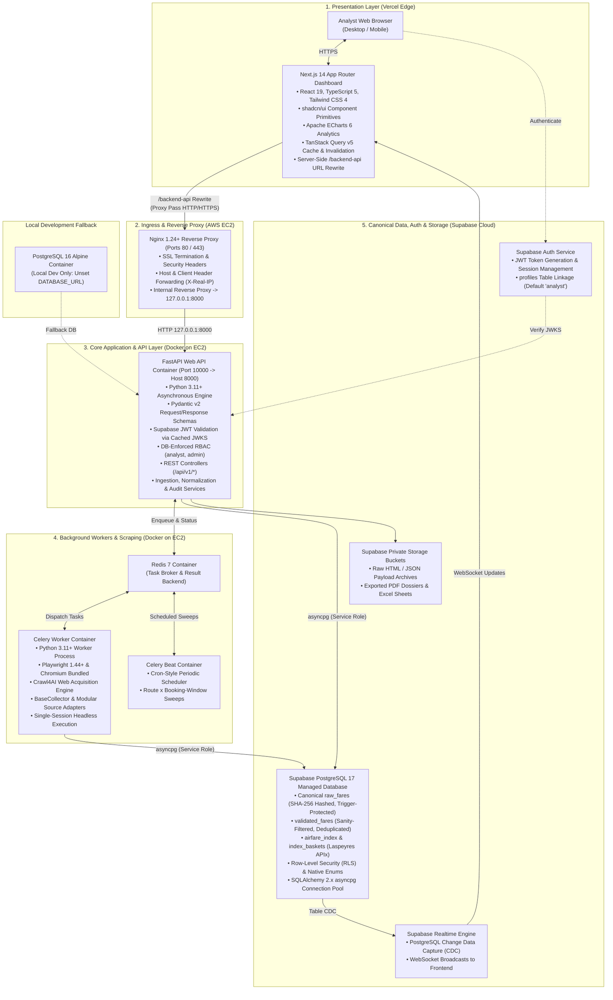
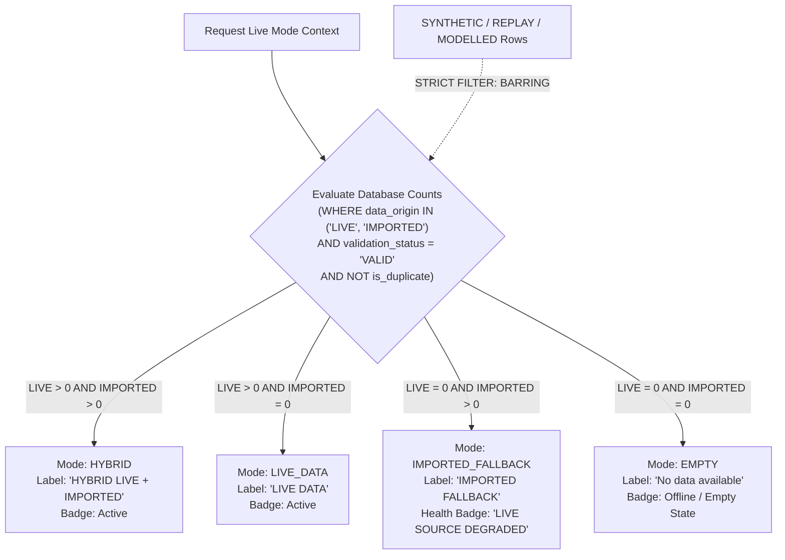
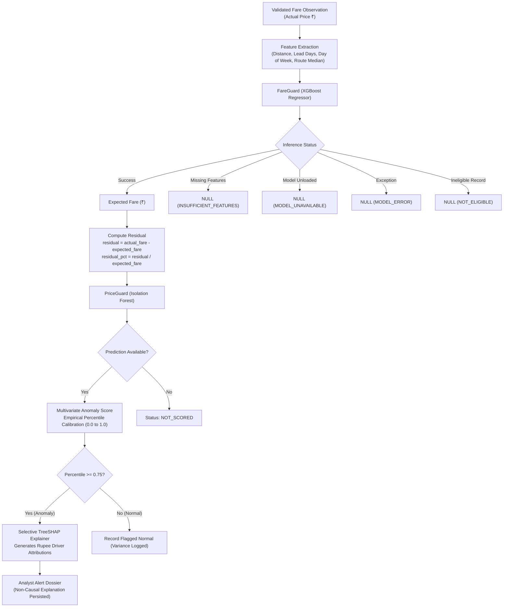
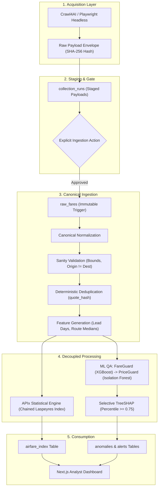
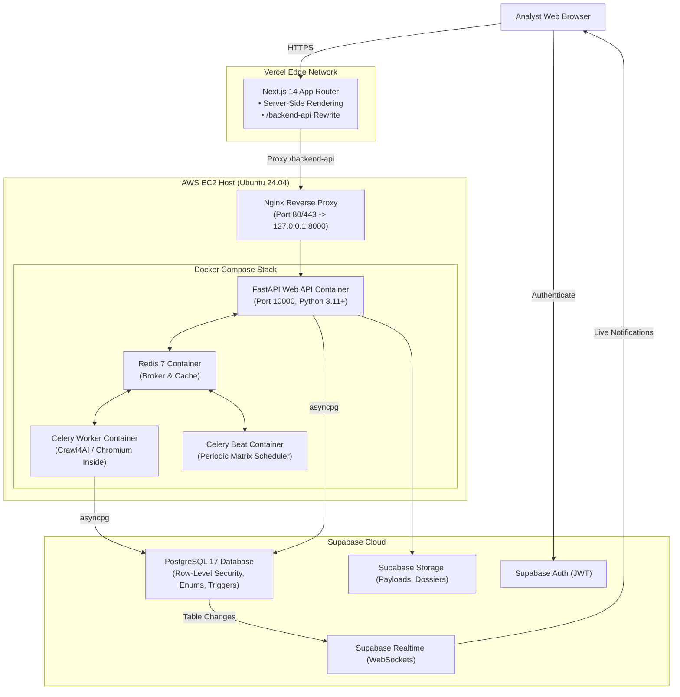
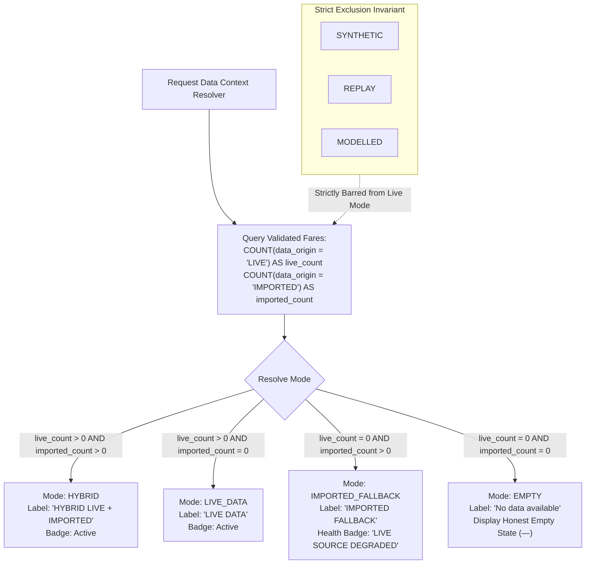

# AirPulse — Real-Time Airfare Price Index for India

> **Real-time Airfare Price Index for India using ethical automated collection, statistical indexing, explainable ML, provenance, and resilient hybrid data ingestion.**

---

## 1. Project Title + One-line Pitch

**AirPulse**  
*Real-time Airfare Price Index for India using ethical automated collection, statistical indexing, explainable ML, provenance, and resilient hybrid data ingestion.*

AirPulse is an institutional-grade airfare statistical intelligence and inflation-monitoring platform designed for the Ministry of Statistics & Programme Implementation (**MoSPI**), the Reserve Bank of India (**RBI**), and economic researchers. It automates the collection of domestic airfare quotes across airline and Online Travel Aggregator (OTA) portals, preserves cryptographic provenance, enforces strict physical-sanity validation, and computes a transparent, high-frequency **Airfare Price Index (APIx)** to augment the national Consumer Price Index (CPI).

---

## 2. Problem Statement

* **Smart India Hackathon Problem ID**: **SIH26056**
* **Ministry / Organization**: **Ministry of Statistics & Programme Implementation (MoSPI) / Data Informatics & Innovation Division (DIID)**
* **Category & Domain**: **Software / Smart Automation**

### Mandated Objectives
1. **Collect Airfare Observations**: Automate the collection of domestic economy airfare quotes across multiple airline and OTA portals via scheduled, ethical web collection.
2. **Normalize and Validate**: Standardize disparate vendor payloads into canonical route, cabin, flight number, departure timing, and net/gross fare structures while rejecting physically corrupt records.
3. **Route & Booking-Window Aware Indicators**: Stratify airfares across standardized advance-purchase booking horizons (`T+1`, `T+7`, `T+15`, `T+30`, `T+45`) across key domestic corridors to eliminate yield-management bias.
4. **Augment CPI-Related Airfare Monitoring**: Provide high-frequency, reliable airfare price relatives to complement the transport component of the Consumer Price Index (CPI).
5. **Preserve Provenance and Reproducibility**: Guarantee an immutable chain of custody with SHA-256 payload hashing, run IDs, and persistent audit trails for every observation and index figure.

---

## 3. System Architecture

AirPulse is architected around a decoupled, multi-tier topology that guarantees operational independence between web presentation, asynchronous browser collection, machine learning quality control, and institutional statistical indexing.



### Detailed Tier Breakdown

1. **Tier 1: Presentation Layer (Vercel)**
   * **Framework**: Next.js 14 App Router with React 19 and TypeScript 5.
   * **Design System**: Tailwind CSS 4 with institutional design tokens and accessible headless primitives via `shadcn/ui`.
   * **Visualizations**: Apache ECharts 6 (`echarts-for-react`) providing interactive advance-purchase yield curves, corridor volatility heatmaps, and SHAP waterfall attributions.
   * **State & Caching**: TanStack Query v5 managing server state, optimistic updates, and automatic query invalidation upon receiving pipeline events.
   * **Secure Edge Proxy**: Configured in `next.config.ts`, the `/backend-api/:path*` route rewrite directs API calls to the server-only `BACKEND_ORIGIN`, preventing browser CORS issues and shielding backend infrastructure.

2. **Tier 2: Ingress & Network Layer (AWS EC2)**
   * **Host Operating System**: Ubuntu 24.04 LTS on AWS EC2.
   * **Reverse Proxy**: Nginx listening on public ports 80/443, enforcing security headers, proxying incoming traffic to `http://127.0.0.1:8000`, and passing client identification headers (`Host`, `X-Real-IP`, `X-Forwarded-For`, `X-Forwarded-Proto`).
   * **Isolation**: Database and Redis ports remain private and unexposed to public AWS security groups.

3. **Tier 3: Core Application & REST API (Docker on EC2)**
   * **Runtime**: Asynchronous Python 3.11+ running FastAPI 0.111+ inside a Docker container.
   * **Internal Port Mapping**: Runs internally on port 10000, mapped to host `127.0.0.1:8000:10000`.
   * **Security & Auth**: Validates Supabase JWTs against project public JWKS keys or shared secrets. User roles (`analyst`, `admin`) are verified against the database `profiles` table.
   * **Database Access**: Fully asynchronous object-relational mapping via SQLAlchemy 2.x and `asyncpg`.

4. **Tier 4: Distributed Workers & Browser Scraping (Docker on EC2)**
   * **Task Orchestration**: Celery 5.4+ connected to Redis 7 (`redis://redis:6379/0`).
   * **Periodic Scheduling**: Celery Beat executing cron-style sweeps across monitored route corridors and booking windows.
   * **Browser Environment**: Playwright Chromium and Crawl4AI runtime dependencies are compiled directly into the container, allowing headless browser execution under Xvfb without host desktop packages.
   * **Resource Governance**: Headless browser concurrency is strictly constrained (`CRAWL4AI_BROWSER_CONCURRENCY=1`) to operate safely within server memory budgets.

5. **Tier 5: Canonical Data, Managed Auth & Storage (Supabase)**
   * **Managed PostgreSQL 17**: Enforces Row-Level Security (RLS), native PostgreSQL enums, and JSONB schemas. An immutable database trigger on `raw_fares` blocks any `UPDATE` or `DELETE` commands.
   * **Supabase Auth**: Issues cryptographic JWTs for analysts and administrators.
   * **Supabase Realtime**: Emits WebSocket broadcasts on database changes, allowing frontend dashboards to update instantly as stages complete.
   * **Supabase Storage**: Private object storage for raw HTML/JSON observation evidence and audit-grade PDF dossiers.
   * **Local PostgreSQL Note**: The `postgres:16-alpine` container in `docker-compose.yml` is strictly a local offline development fallback. Production environments connect directly to Supabase.

---

## 4. Architecture Workflow

AirPulse enforces strict separation between data collection and analytical ingestion. Collected payloads staged during web scraping cannot affect downstream analytics or indices until they pass through an explicit ingestion step.

```mermaid
flowchart TD
    subgraph Step1["Step 1: Ethical Multi-Source Web Acquisition"]
        Req["SearchRequest Input\n(Origin, Destination, Date, Cabin='economy')"] --> RobCheck{"Check robots.txt &\nPolicy Status"}
        RobCheck -- Disallowed --> Skip["Status: SKIPPED_POLICY\n(Halt Execution)"]
        RobCheck -- Allowed --> EngRoute{"Engine Selector (AUTO)"}
        EngRoute --> C4AI["Crawl4AI / Playwright\n(Headless Chromium, Concurrency=1)"]
        EngRoute --> HTTP["Async HTTP / Scrapy\n(Lightweight APIs)"]
        C4AI --> AccCheck{"Detect 403, 429,\nor CAPTCHA"}
        AccCheck -- Restriction Detected --> Halt["Status: BLOCKED / CAPTCHA_DETECTED\n(Stop-and-Report, No Evasion)"]
        AccCheck -- Clear --> ExtCard["Extract Public Flight Cards\n(Price, Taxes, Airline, Flight No)"]
        HTTP --> ExtCard
    end

    subgraph Step2["Step 2: Staging & Explicit Ingestion Gate"]
        ExtCard --> RawEnv["Create Raw Envelope\n(UUID, Run ID, Timestamp, SHA-256 Hash)"]
        RawEnv --> StagingDB["Write to collection_runs & Staging Storage\n(Isolated from Analytics)"]
        StagingDB --> Gate{"Explicit Action:\n'Send to Data Ingestion'\n(Manual or Scheduled Trigger)"}
        Gate -- Not Triggered --> StagedOnly["Staged Payloads Remain Isolated\n(Zero Impact on Indices or Models)"]
    end

    subgraph Step3["Step 3: Canonical Ingestion & Validation"]
        Gate -- Approved --> RawStore["Write to raw_fares\n(PostgreSQL Trigger: Immutable Append-Only)"]
        RawStore --> Norm["Canonical Normalization\n(Standardize IATA, Cabin, Timestamps, Currency)"]
        Norm --> Sanity{"Physical-Sanity Validation\n• Fare ₹500 - ₹500,000\n• Origin != Destination\n• Valid 3-Letter IATA Codes\n• Base Fare <= Total Fare"}
        Sanity -- Invalid --> AuditRej["Write to audit_logs\n(Status: REJECTED with Reason Code)"]
        Sanity -- Valid --> Dedup["Deterministic Deduplication\n(Compute quote_hash)"]
        Dedup --> DupCheck{"Duplicate Found?"}
        DupCheck -- Yes --> MarkDup["Mark is_duplicate = true\n(Preserved in DB, Excluded from Index)"]
        DupCheck -- No --> ValStore["Write to validated_fares\n(Status: VALID)"]
    end

    subgraph Step4["Step 4: Feature Engineering"]
        ValStore --> FeatGen["Feature Generation Service\n• Booking Window Lead Days (T+1 to T+45)\n• Day of Week, Is Weekend, Seasonality\n• Rolling Route Median, Std Dev, Volatility"]
        FeatGen --> FeatStore["Write to fare_features Table"]
    end

    subgraph Step5["Step 5: Decoupled Processing Branches"]
        FeatStore --> BranchA["Branch A: Statistical Index Engine (APIx)"]
        FeatStore --> BranchB["Branch B: ML Quality Assurance Layer"]

        subgraph SubBranchA["Statistical Index (Pure Math)"]
            BranchA --> FilterElig["Filter: Cabin='economy', Status='VALID',\nOrigin IN ('LIVE', 'IMPORTED'), Not Duplicate"]
            FilterElig --> StrataCell["Stratify by Route (r) and Booking Window (b)"]
            StrataCell --> CellMed["Compute Representative Cell Price: P(r,b,t) = Median"]
            CellMed --> RelCalc["Compute Price Relative: P(r,b,t) / P(r,b,0)"]
            RelCalc --> LaspAgg["Laspeyres Matched-Basket Aggregation\nSum(w * Relative) / Sum(w)"]
            LaspAgg --> QScore["Compute Coverage Quality Score (Q)\nQ = 0.40 Cr + 0.25 Cs + 0.20 F + 0.15 V"]
            QScore --> IndexDB["Write to airfare_index &\nindex_components Tables"]
        end

        subgraph SubBranchB["ML Quality Assurance (Observational QA)"]
            BranchB --> FG["FareGuard (XGBoost Regressor)\nPredict Expected Fare ₹"]
            FG --> ResCalc["Compute Residual:\nresidual = actual_fare - expected_fare"]
            ResCalc --> PG["PriceGuard (Isolation Forest)\nMultivariate Anomaly Scoring"]
            PG --> PGBin{"Empirical Percentile >= 0.75?"}
            PGBin -- Yes (Anomaly) --> SHAP["Selective TreeSHAP Explainer\nCompute Rupee Impact Feature Drivers"]
            PGBin -- No (Normal) --> NormLog["Log Normal Record Variance"]
            SHAP --> AnomDB["Write to anomalies &\nalerts Tables"]
            NormLog --> AnomDB
        end
    end

    subgraph Step6["Step 6: Realtime Notification & Presentation"]
        IndexDB --> RTBroad["Supabase Realtime Broadcast"]
        AnomDB --> RTBroad
        RTBroad --> PushDash["Next.js Analyst Dashboard Updates\n(TanStack Query Cache Invalidation)"]
        PushDash --> Export["Executive Dossier Exports\n(Audit-Grade PDF & Excel Spreadsheets)"]
    end
```



### Detailed Phase-by-Phase Workflow

1. **Phase 1: Ethical Multi-Source Web Acquisition**
   * Pre-flight checks verify `robots.txt` and administrative compliance review notes.
   * `SearchRequest` inputs specify standard research parameters (Economy, 1 adult, INR).
   * The collector engine launches single-session headless Chromium or async HTTP requests.
   * If upstream access barriers (HTTP 403, 429, CAPTCHA) are encountered, execution halts immediately with truthful status logging.

2. **Phase 2: Staging & Explicit Ingestion Gate**
   * Extracted flight cards are wrapped in a cryptographic envelope containing a SHA-256 hash of the raw response.
   * Raw payloads are staged in `collection_runs`.
   * **Critical Invariant**: Staged data remains completely isolated and cannot affect analytics, price indices, or machine learning models until an operator or scheduler explicitly triggers the ingestion action.

3. **Phase 3: Canonical Ingestion & Validation**
   * Staged observations pass through the ingestion gate and are written to `raw_fares`.
   * An immutable database trigger enforces write-once behavior on `raw_fares`.
   * Disparate structures are parsed into uniform route codes, carrier names, flight numbers, and net/tax fare amounts.
   * Strict physical-sanity rules reject impossible fares (outside ₹500–₹500,000, $O = D$, malformed IATA codes), writing rejections to `audit_logs`.
   * Deduplication assigns `is_duplicate = true` based on deterministic `quote_hash` matching without deleting any rows.

4. **Phase 4: Feature Engineering**
   * Generates analytical attributes: advance booking lead days, booking window bucket (`T+1`, `T+7`, `T+15`, `T+30`, `T+45`), day of week, weekend flags, and historical rolling corridor medians.
   * Feature rows are persisted to `fare_features`.

5. **Phase 5: Decoupled Processing Branches**
   * **Branch A (APIx Statistical Engine)**: Operates strictly on validated, non-duplicate observed fares from `LIVE` and `IMPORTED` origins. Groups fares into corridor $\times$ booking-window cells, computes median prices, derives price relatives against baseline periods, and calculates the national Laspeyres index along with coverage quality metric ($Q$).
   * **Branch B (ML Quality Assurance)**: Runs independently. FareGuard (XGBoost) predicts the expected baseline fare. PriceGuard (Isolation Forest) scores multivariate anomaly percentiles. For flagged anomalies (percentile $\ge 0.75$), TreeSHAP generates non-causal rupee attributions explaining model divergence.

6. **Phase 6: Realtime Notification & Presentation**
   * Index values, anomalies, and pipeline step transitions are written to the database.
   * Supabase Realtime emits WebSocket broadcasts to connected browser sessions.
   * TanStack Query invalidates affected queries, updating dashboard charts, yield curves, and alert feeds instantly.
   * Analysts can generate audit-grade PDF dossiers and Excel workbooks on demand.

---

## 5. Technology Stack with Details

| Layer / Domain | Technology | Version | Purpose & Technical Implementation Details |
|---|---|---|---|
| **Frontend Framework** | Next.js | 14+ (App Router) | Server-side rendering (SSR), layout nesting, React Server Components, dynamic client routing, and edge delivery. Handles server-side `/backend-api` rewrites to isolate backend origins. |
| **Frontend Language** | TypeScript | 5.x | Enforces strict compile-time typing across analytical models, dashboard properties, API responses, and chart configurations matching backend Pydantic models. |
| **Styling & Design Tokens** | Tailwind CSS | 4.x | Utility-first styling framework implementing customized institutional tokens (neutral dark modes, accessible contrast ratios, tabular spacing). |
| **Component Primitives** | shadcn/ui | Latest | Accessible, headless UI components built on Radix UI primitives, ensuring high keyboard and screen-reader accessibility. |
| **Interactive Analytics** | Apache ECharts | 6.x (`echarts-for-react`) | Interactive high-performance Canvas/SVG rendering for advance-purchase yield curves, index comparison trendlines, corridor heatmaps, and SHAP waterfall charts. |
| **Server State Management** | TanStack Query | 5.x | Asynchronous data fetching, automatic background revalidation, query deduplication, and event-driven cache invalidation from Realtime WebSocket events. |
| **Client Auth & Realtime** | Supabase JS | 2.x (`@supabase/supabase-js`) | Manages client-side session tokens, secure authentication flows, and WebSocket channel subscriptions for live database table updates. |
| **Backend Runtime** | Python | 3.11+ | Core asynchronous runtime leveraging performance enhancements in modern asyncio and typed data pipelines. |
| **Web Framework** | FastAPI | 0.111+ | Asynchronous REST framework serving self-documenting OpenAPI (Swagger) contracts with high-throughput JSON serialization. |
| **Data Validation** | Pydantic | v2 | High-speed C-based model validation for request payloads, API responses, and environment settings. |
| **Database ORM** | SQLAlchemy | 2.x (async) | Fully asynchronous SQL toolkit and Object-Relational Mapper executing typed database queries via Python coroutines. |
| **Database Driver** | asyncpg | 0.29+ | Asynchronous, binary-protocol PostgreSQL client driver providing low-latency database connectivity (`postgresql+asyncpg`). |
| **Schema Migrations** | Alembic | 1.13+ | Version-controlled database migration framework acting as the single source of truth for all tables, triggers, enums, and foreign keys. |
| **Web Acquisition Engine** | Crawl4AI | 0.9+ | Python-based automated scraping layer using Crawl4AI with Playwright/Chromium, designed for multi-source airline/OTA collection and extensible to Scrapy/direct Playwright adapters. Executes dynamic JS rendering under bounded concurrency. |
| **Browser Automation** | Playwright / Chromium | 1.44+ | Headless Chromium automation engine bundled inside the backend Docker container, operating under Xvfb for rendering dynamic single-page applications. |
| **HTTP & Static Collection** | Scrapy & HTTPX | Latest | High-throughput asynchronous crawler and async HTTP client for static pages, `robots.txt` parsing, and public REST endpoints. |
| **Task Queue & Workers** | Celery | 5.4+ | Distributed task queue managing asynchronous execution of browser extraction, data ingestion, feature generation, and ML scoring. |
| **Task Scheduling** | Celery Beat | 5.4+ | Cron-style periodic scheduler triggering automated collection sweeps across the route corridor $\times$ booking-window search matrix. |
| **Message Broker & Cache** | Redis | 7.x | High-speed in-memory key-value store serving as the Celery task broker, result backend, and transient application cache. |
| **Expected Fare ML** | XGBoost | 2.0+ | **FareGuard**: Gradient-boosted regression tree predicting expected baseline fares from route distance, booking horizon, seasonality, and rolling medians using time-based validation splits. |
| **Anomaly Detection ML** | scikit-learn | 1.5+ | **PriceGuard**: Multivariate Isolation Forest evaluating actual fares, predicted baselines, residuals, and route dispersion using empirical percentile ranking. |
| **Explainable ML** | SHAP | 0.45+ | TreeSHAP explainer generating selective, non-causal rupee feature attributions exclusively for flagged pricing anomalies ($\ge 0.75$ percentile) and on-demand audits. |
| **Statistical Mathematics** | NumPy / SciPy / Pandas | Latest | Vectorized numerical data transformations, empirical percentile ranking, and Laspeyres / Jevons matched-basket index aggregation. |
| **Canonical Database** | Supabase PostgreSQL | PostgreSQL 17 | Managed institutional relational database with Row-Level Security (RLS), native ENUMs, JSONB storage, and trigger-enforced raw immutability. |
| **Identity & Security** | Supabase Auth | Managed | Cryptographic JWT issuance, user registration, session management, and JWKS signature verification. |
| **Live Notifications** | Supabase Realtime | Managed | WebSocket-based Change Data Capture (CDC) listening to PostgreSQL table commits and broadcasting updates to the frontend. |
| **Audit Object Storage** | Supabase Storage | Managed | Private S3-compatible object storage buckets archiving raw HTML/JSON payload snapshots and generated PDF dossiers. |
| **Cloud Compute Host** | AWS EC2 | Ubuntu 24.04 LTS | Virtual server host executing containerized FastAPI, Celery worker, Celery Beat, and Redis services. |
| **Reverse Proxy & Ingress** | Nginx | 1.24+ | Reverse proxy handling public port 80/443 traffic, security headers, SSL termination, and proxying to container port 8000. |
| **Container Orchestration**| Docker & Docker Compose | Compose v2 | Multi-container packaging providing reproducible execution across development, staging, and production environments. |
| **Edge Hosting** | Vercel | Production | Global content delivery network hosting the Next.js frontend with automated deployment pipelines. |

---

## 6. Why AirPulse

In macroeconomic statistics and aviation analytics, notable research and operational gaps exist:

* **Static Predictions vs. Real-Time Indexing**: Most aviation pricing solutions focus on predicting single future ticket fares for consumer booking. AirPulse addresses the less common yet critical requirement: calculating an auditable, high-frequency macroeconomic price index for statistical and policy monitoring.
* **Black-Box ML vs. Institutional Explainability**: Commercial airline dynamic pricing models rely on opaque algorithms. Statistical agencies require transparent index formulations (Laspeyres / Jevons) paired with explainable machine learning (selective TreeSHAP) strictly reserved for quality assurance and anomaly detection.
* **Weak Provenance in Web Data**: Web-scraped datasets often lack reproducible audit trails. AirPulse couples raw payload hashing, collector metadata, and database immutability to withstand institutional audit standards.
* **Preserving Economic Shocks vs. Blind Outlier Removal**: Typical data pipelines discard extreme prices as noise. AirPulse distinguishes between corrupt entries (e.g., negative prices, malformed flight numbers) and genuine macroeconomic market shocks (e.g., holiday surges, capacity crunches), preserving real economic signals for inflation measurement.
* **Resilient Handling of Data Modes**: Web portals undergo frequent frontend adjustments and access changes. An institutional system cannot halt when an upstream portal challenge occurs; it requires a disciplined hybrid fallback mechanism supporting verified imported baselines alongside live feeds, with isolated demo modes.

---

## 7. Key USPs — The Four Pillars

```
┌──────────────────────────────────────────────────────────────────────────────┐
│                            AIRPULSE FOUR PILLARS                             │
├──────────────────────┬──────────────────────┬────────────────────────────────┤
│       TRUST          │      RESILIENCE      │   INTELLIGENCE & INTEGRITY     │
├──────────────────────┼──────────────────────┼────────────────────────────────┤
│ • SHA-256 Provenance │ • LIVE + IMPORTED    │ • FareGuard (XGBoost Regressor)│
│ • Immutable Raw Log  │   Graceful Fallback  │ • PriceGuard (Isolation Forest)│
│ • Audit Trail        │ • Clear Degradation  │ • Selective SHAP Attribution   │
│ • Origin Labels      │   States (No Fake)   │ • Pure APIx (Independent of ML)│
└──────────────────────┴──────────────────────┴────────────────────────────────┘
```

### Pillar 1: TRUST
* **SHA-256 Provenance**: Every collected payload is hashed using SHA-256 upon reception and written to an append-only raw store protected by database triggers.
* **Complete Chain of Custody**: Every observation links to its source ID, collection run ID, pipeline run ID, collector engine, source URL, HTTP status, and ingestion timestamp.
* **Explicit Origin Labels**: Records are categorized (`LIVE`, `IMPORTED`, `REPLAY`, `SYNTHETIC`, `MODELLED`), preventing unverified or simulated data from entering official statistics.

### Pillar 2: RESILIENCE
* **Hybrid LIVE + IMPORTED Architecture**: Combines live automated browser extraction with verified historical data imports (`GoibiboCsvImporter`, official reference datasets).
* **Clear Degradation States**: If a live source encounters rate limiting or bot detection, the system transitions to an honest `IMPORTED_FALLBACK` ("LIVE SOURCE DEGRADED") or `EMPTY` state. AirPulse never manufactures synthetic data to simulate uptime in live views.
* **Decoupled Architecture**: Statistical index calculations run independently from machine learning inference. If an ML dependency fails, index computation continues uninterrupted.

### Pillar 3: INTELLIGENCE
* **FareGuard (XGBoost)**: Provides expected baseline fares conditional on route distance, lead days, day of week, seasonality, and rolling corridor medians.
* **PriceGuard (Isolation Forest)**: Multivariate anomaly detector scoring actual fares against predicted baselines, residuals, and route dispersion using empirical percentile ranking.
* **Selective TreeSHAP**: Evaluates feature attribution in rupee terms exclusively for anomalies ($\ge 0.75$ percentile) and on-demand audits, minimizing unnecessary compute.

### Pillar 4: STATISTICAL INTEGRITY
* **Zero ML Imputation in Official APIx**: The Airfare Price Index is computed strictly from verified, observed market quotes. ML outputs are never used to impute missing observations.
* **Route & Booking-Window Methodology**: Prevents yield-management skew by indexing advance-purchase horizons (`T+1` to `T+45`) across monitored corridors individually before basket aggregation.
* **Coverage Quality Metric ($Q$)**: Every index point carries a published composite score measuring route coverage, source diversity, temporal freshness, and validation rate.

---

## 8. Collection Architecture

AirPulse structures all acquisition around an extensible, object-oriented collector layer located in `app/collectors/`.

```
                  BaseCollector (Abstract Contract)
                                │
        ┌───────────────────────┼───────────────────────┐
        │                       │                       │
Crawl4AICollector      PlaywrightCollector        ScrapyCollector
 (HappyFares DOM)       (Headless Script)        (High-Throughput)
        │                       │                       │
        └───────────────────────┼───────────────────────┘
                                │
                                ▼
                       SearchRequest Input
                                │
                                ▼
                   Normalized CollectorResult
```

### Core Contracts & Registry
* **`BaseCollector`**: Abstract contract enforcing rate limits (`rate_limit_per_minute`), timeouts (`timeout_seconds`), backoff retries, and raw payload envelope creation.
* **Dynamic Source Registry**: Discovers and instantiates registered collector classes dynamically based on source identifiers and configured capabilities.
* **`SearchRequest`**: Strongly-typed model specifying origin IATA, destination IATA, departure date, passenger count (fixed to 1), cabin class (economy), and currency (`INR`).
* **`CollectorResult` & Raw Envelope**: Immutable container bundling extracted flight quotes, HTTP status, request IDs, collector version, and a SHA-256 hash of the raw response payload.

### Standardized Engine Outcomes & Statuses
AirPulse records exact operational statuses rather than generic failure codes:
* `SUCCESS`: Flights observed, validated, and staged successfully.
* `PARTIAL`: Fewer quotes retrieved than requested, but returned fares are valid.
* `NO_AVAILABILITY`: Source successfully returned zero scheduled flights for the requested corridor/date.
* `BLOCKED`: Source returned an HTTP 403 or explicit "Access Denied" response.
* `CAPTCHA_DETECTED`: Source presented a human verification challenge (Cloudflare, hCaptcha, etc.).
* `AUTH_REQUIRED`: Portal requires interactive login or session cookies.
* `FAILED`: Internal extraction exception or unexpected crash.
* `SKIPPED_POLICY`: Extraction aborted because `robots.txt` disallows the path or operator review notes are absent.
* `CONTENT_REQUIRES_JS`: Static extractor failed because dynamic DOM hydration is required.
* `NOT_FOUND`: Upstream search route or carrier URL returned HTTP 404.
* `PARSE_ERROR`: Page rendered successfully, but DOM structure did not match expected selectors.
* `RATE_LIMITED`: Upstream HTTP 429 Too Many Requests response.
* `TIMEOUT`: Network or rendering deadline exceeded.
* `HTTP_ERROR`: Unhandled 5xx server-side error on upstream portal.

### Execution Engine Model
AirPulse supports five operational collection engines:
1. `AUTO`: Dynamically evaluates source complexity; routes to Crawl4AI/Playwright for JS-heavy portals or HTTP for simple APIs.
2. `CRAWL4AI`: Headless Chromium managed through Crawl4AI for complex single-page applications.
3. `SCRAPY`: Asynchronous scraping engine for high-volume static pages and lightweight endpoints.
4. `PLAYWRIGHT`: Direct Playwright script execution with fine-grained event listeners.
5. `REPLAY`: Offline playback of pre-recorded fixture runs for reproducible testing.

*Current Prototype Behavior*: In `AUTO` mode, dynamic airline/OTA portals route to the Crawl4AI / Playwright-based execution path.

### Bounded Operational Behavior
To ensure responsible research execution:
* **Low Concurrency**: Maximum concurrent browser sessions restricted to 1 (`CRAWL4AI_BROWSER_CONCURRENCY=1`).
* **Strict Result Caps**: Max 5–15 observations per crawl (`CRAWL4AI_DEFAULT_MAX_RESULTS=5`).
* **Browser Concurrency 1**: Exactly 1 browser instance runs at a time to prevent resource exhaustion.
* **Stop on Access Restrictions**: Halts instantly upon encountering access restrictions.
* **No CAPTCHA Bypass**: Captchas are detected and reported, never solved.
* **No Proxy Evasion**: No residential proxy pools or rotating IP infrastructure.
* **No Anti-Bot Circumvention**: Does not forge browser fingerprints or evade security controls.

---

## 9. Ethical Collection Design

AirPulse adheres to defensive, ethical web extraction practices suited for government statistical bodies:

* **Robots.txt & Terms/Policy Review**: The engine checks the upstream portal's `robots.txt` before launching any browser instance. If the target URL path is disallowed for the research user agent, collection halts with `SKIPPED_POLICY`.
* **Rate Limiting**: Built-in throttles enforce minimum delays between requests (default 60s) and trigger a 5-minute cooldown upon any upstream failure.
* **Bounded Requests**: Requests are capped to modest counts (5–15 quotes) to prevent load on upstream servers.
* **Block & CAPTCHA Detection**: Automated heuristics identify HTTP 403, HTTP 429, Cloudflare challenge walls, and CAPTCHA markers.
* **Stop-and-Report Behavior**: When an access barrier is detected, AirPulse immediately logs the exact failure stage and aborts execution. It never attempts to bypass access controls.
* **No Bypass of Restrictions**: No evasion of 403 Forbidden, 429 Too Many Requests, CAPTCHAs, or access barriers.
* **HappyFares Bounded Prototype**: HappyFares is currently enabled as a bounded prototype source in code under strict review toggles (`HAPPYFARES_PROTOTYPE_ENABLED=false` by default, requiring operator verification notes).

---

## 10. Data Origins and Operational Modes

Every record in AirPulse is tagged with an immutable `data_origin` label:

| Origin | Meaning | Eligibility |
|---|---|---|
| `LIVE` | Fares extracted in real time by automated collectors. | Eligible for Live Mode and official APIx calculation. |
| `IMPORTED` | Real-world observations imported from verified external files (e.g., historical OTA exports). | Eligible for Live Mode and official APIx calculation as a fallback. |
| `REPLAY` | Historical recorded payloads replayed through the pipeline for deterministic regression testing. | Prohibited from Live Mode metrics; used in test harnesses. |
| `SYNTHETIC` | Mathematically generated observations for load testing and empty-state development. | **Strictly prohibited** from Live Mode metrics and official APIx. |
| `MODELLED` | Algorithmic estimations generated by FareGuard (XGBoost). | Used solely for QA benchmarks and anomaly residuals; never enters the index. |



### Live Mode Rules
* `LIVE > 0` and `IMPORTED > 0` $\rightarrow$ **HYBRID** (`HYBRID LIVE + IMPORTED`)
* `LIVE = 0` and `IMPORTED > 0` $\rightarrow$ **IMPORTED_FALLBACK** (`IMPORTED FALLBACK`, health badge: `LIVE SOURCE DEGRADED`)
* `LIVE > 0` and `IMPORTED = 0` $\rightarrow$ **LIVE_DATA** (`LIVE DATA`)
* Neither (`LIVE = 0` and `IMPORTED = 0`) $\rightarrow$ **EMPTY** (`No data available`)

**Invariant**: Never allow `SYNTHETIC`, `REPLAY`, or `MODELLED` to silently appear as `LIVE`.

### Demo Mode
* In Demo Mode (`DEMO_MODE=true`), the frontend displays isolated synthetic and replay snapshots with prominent visual badges (`DEMO MODE` / `MOCK DATA`), allowing interface inspection without network activity.

---

## 11. Provenance Model

To ensure statistical auditability for MoSPI and RBI analysts, AirPulse captures complete observation-level provenance:

```
┌──────────────────────────────────────────────────────────────────────────────┐
│                        AIRPULSE OBSERVATION PROVENANCE                       │
├──────────────────────────┬───────────────────────────────────────────────────┤
│ Observation ID           │ UUID v4 (Primary Key in raw_fares & validated)    │
│ Source ID                │ Originator portal / carrier identifier            │
│ Collection Run ID        │ Links back to collection_runs batch execution     │
│ Pipeline Run ID          │ Identifies the exact downstream processing run   │
│ Acquisition Method       │ Automated engine (CRAWL4AI, PLAYWRIGHT, HTTP)     │
│ Data Origin              │ LIVE, IMPORTED, REPLAY, SYNTHETIC, MODELLED       │
│ Provider                 │ Airline carrier or aggregator name                │
│ Observed Timestamp       │ Exact UTC timestamp of collection from portal     │
│ Source URL / Evidence    │ Target itinerary search URL and raw response body │
│ Checksum / Hash          │ SHA-256 cryptographic hash of raw response        │
│ Importer Identity        │ User ID / system identity triggering the run      │
│ Audit Trail              │ Append-only log of validation decisions & edits   │
└──────────────────────────┴───────────────────────────────────────────────────┘
```

Raw records written to `raw_fares` are protected by a PostgreSQL trigger that rejects any `UPDATE` or `DELETE` statement, preserving an immutable historical log.

---

## 12. Validation / Outlier Philosophy

AirPulse enforces strict rules to prevent corrupt inputs from distorting economic indicators:

1. **Invalid Records Rejected**: Records failing physical-sanity bounds are rejected and routed to audit logs with reason codes:
   * Net/gross fare outside ₹500–₹500,000.
   * Origin IATA identical to Destination IATA ($O = D$).
   * Malformed or unrecognized 3-letter IATA airport codes.
   * Negative taxes or base fares exceeding total fares.
2. **Duplicates Marked / Deduped**: Repeated observations for the same flight number, departure time, and fare are marked with `is_duplicate = true` based on their deterministic `quote_hash`. Duplicate rows remain in the database for frequency analysis but are excluded from index aggregation. Records are never purged.
3. **Valid Unusual Fares Preserved**: High fares (e.g., last-minute festival surges of ₹35,000 on DEL–BOM) pass sanity validation and are preserved in the index basket. Valid prices reflecting market dynamics are never censored.
4. **Economic Shocks Preserved**: Systemic price surges caused by holiday seasons or capacity crunches are treated as macroeconomic inflation signals, not noise.
5. **Sold-Out Representation**: Flights with zero seat availability are recorded with status `NO_AVAILABILITY`. They are **never** represented as `fare = 0`.
6. **Missing ML Predictions**: If FareGuard cannot produce an inference, the value is recorded as `NULL` (`MODEL_UNAVAILABLE`). The system **never** inserts fake ₹0 predictions.

---

## 13. Machine Learning Quality Assurance Layer

Machine learning in AirPulse functions as an **observational quality assurance system** around the index pipeline, never inside it.



### FareGuard
* **XGBoost Expected Fare Model**: Predicts expected baseline fare conditional on route distance, lead days, day of week, seasonality, fuel index, and historical rolling medians.
* **Active Model Registry**: Tracks serialized model artifacts (`models/`) with metadata, version strings, and feature definitions.
* **Batch Inference**: Processes feature batches asynchronously without blocking request serving.
* **Temporal Train/Validation Strategy**: Employs time-based splitting (70% train, 15% validation, 15% test) to prevent forward-looking data leakage.
* **Retraining Separate from Inference**: Retraining runs as scheduled offline batch jobs; models are never trained synchronously inside web requests.
* **Explicit Prediction States**:
  * `SCORED`: Valid expected fare computed.
  * `MODEL_UNAVAILABLE`: Pre-trained model weights not loaded.
  * `INSUFFICIENT_FEATURES`: Missing required input attributes.
  * `MODEL_ERROR`: Numerical failure or prediction outside sanity bounds.
  * `NOT_ELIGIBLE`: Record type not eligible for estimation (non-economy, invalid date).

### PriceGuard
* **Isolation Forest**: Multivariate anomaly detector evaluating pricing behavior.
* **Features Used**: Actual fare, predicted fare, residual (₹), residual percentage (%), booking window lead days, recent route median, recent route standard deviation, and volatility.
* **Prediction Unavailable State**: If FareGuard produces no prediction, PriceGuard assigns `NOT_SCORED`.

### Selective SHAP
* **Selective Invocation**: TreeSHAP values are evaluated only for flagged anomalies (percentile $\ge 0.75$), high-residual excursions, representative samples, or on-demand analyst review requests.
* **Persisted Explanation**: Persisted as structured JSON detailing top feature drivers and directional rupee contributions.
* **Not Causal**: SHAP values explain *why the model expected ₹X*; they do not assert causal economic market mechanisms.

---

## 14. APIx Design — Pure Statistical Formulation

The **Airfare Price Index (APIx)** is completely independent from machine learning models.

* **Observed Data Only**: Calculated strictly from validated, eligible observed fares (`LIVE` + `IMPORTED`) for economy cabin travel.
* **Route Basket & Booking Windows**: Stratified by directional route corridors and advance booking lead times.
* **Route Weights**: Basket route weights represent passenger traffic shares across monitored corridors.
* **Daily Index Generation**: Computed daily using a matched-basket chained Laspeyres index methodology:

$$\text{APIx}_t = 100 \times \frac{\sum_{r} \sum_{b} w(r,b) \cdot \left[ \frac{P(r,b,t)}{P(r,b,0)} \right]}{\sum_{r} \sum_{b} w(r,b)}$$

Where:
* $r$: Directional route corridor (e.g., `DEL → BOM`).
* $b$: Standard advance booking window (`T+1`, `T+7`, `T+15`, `T+30`, `T+45`).
* $P(r,b,t)$: Representative price (median validated fare) for route $r$ and window $b$ on day $t$.
* $P(r,b,0)$: Baseline period price for the identical route and booking-window cell.
* $w(r,b)$: Statistical basket weight assigned to corridor $r$ and window $b$.

> [!IMPORTANT]
> **Prototype Basket Designation:**  
> The current index basket in AirPulse is explicitly labelled as a **PROTOTYPE basket**. Route and booking-window weights represent baseline passenger shares until official MoSPI Price Statistics Division (PSD) or DGCA annual traffic weights are loaded into the active basket. Obsolete historical CPI weights are not used as current weights.

---

## 15. Representative Prototype Basket

The prototype database incorporates high-density domestic corridors and stratified booking windows:

### Representative Routes
* **`DEL-BOM`**: Delhi $\leftrightarrow$ Mumbai (High-density trunk corridor)
* **`DEL-BLR`**: Delhi $\leftrightarrow$ Bengaluru (Business / Tech corridor)
* **`BOM-BLR`**: Mumbai $\leftrightarrow$ Bengaluru (Commercial corridor)
* **`DEL-CCU`**: Delhi $\leftrightarrow$ Kolkata (East-West trunk corridor)
* **`BLR-HYD`**: Bengaluru $\leftrightarrow$ Hyderabad (Regional tech corridor)
* **`MAA-DEL`**: Chennai $\leftrightarrow$ Delhi (North-South trunk corridor)

### Advance Booking Windows
* **`T+1`** (0–2 days): Emergency / Last-minute business travel (highest yield variance)
* **`T+7`** (3–10 days): Short-notice commercial travel
* **`T+15`** (11–20 days): Short-term planned travel (baseline anchor)
* **`T+30`** (21–35 days): Advance planned leisure / personal travel
* **`T+45`** (36+ days): Long-range advance booking (promotional fare tier)

*Note: These are prototype representative routes and booking windows until official production weights are loaded.*

---

## 16. Realtime Pipeline & Monitoring

Pipeline execution is tracked across granular stages with independent database transactions:

* **`pipeline_runs` & `pipeline_steps`**: Track every phase from collection through normalization, validation, deduplication, feature extraction, ML scoring, and index calculation.
* **Stage Attributes**: Each step records its `status` (`PENDING`, `RUNNING`, `COMPLETED`, `PARTIAL`, `FAILED`, `SKIPPED`), start/finish timestamps, duration, processed row count, error backtraces, progress percentage, and retry attempts.
* **Idempotency**: Downstream steps can be safely retried without creating duplicate records or corrupting raw inputs.
* **Independent Stage Commits**: Each pipeline step executes within its own database transaction to ensure partial failures do not roll back completed stages.

### Frontend Pages Updated from Realtime / Invalidation
Frontend views subscribe to Supabase Realtime WebSocket events and TanStack Query cache invalidation:
* **Overview**: Headline APIx index, daily movement, and collection health.
* **APIx**: Historical index trendlines, Laspeyres relatives, and basket breakdowns.
* **Fare Explorer**: Searchable grid of validated fares with full filter controls.
* **Provenance**: End-to-end chain of custody and raw extraction evidence viewer.
* **Route Intelligence**: Corridor-level fare dispersion, median comparisons, and volume.
* **Booking Windows**: Advance-purchase yield curves across `T+1` to `T+45`.
* **Anomalies**: PriceGuard flagged outliers with severity indicators.
* **Alerts**: Active threshold notifications (price shocks, source degradation).
* **Models**: Active model registry status, evaluation metrics, and drift monitors.
* **Pipeline Monitor**: Real-time stage execution timeline and task diagnostics.
* **Data Quality**: Coverage quality metric ($Q$), rejection breakdown, and deduplication stats.
* **Run History**: Complete historical log of collection and ingestion batches.

---

## 17. Database / Schema Architecture

Database migrations managed via **Alembic** (`airpulse-api/alembic/versions/`) serve as the single source of truth for schema definitions.

### Core Entity Groups
* **Canonical Raw Store**: `raw_fares` (immutable SHA-256 payload store, protected by trigger).
* **Validated Fares**: `validated_fares` (normalized, sanity-filtered, deduplicated observations).
* **Feature Store**: `fare_features` (lead days, day of week, rolling route medians).
* **ML Inference & Quality**: `fare_predictions` (FareGuard), `anomalies` (PriceGuard), `shap_explanations`.
* **Index Tables**: `airfare_index`, `index_baskets`, `index_basket_routes`, `index_components`.
* **Model Registry**: `ml_models` (model versions, active flags, performance metrics).
* **Audit & Reference Tables**: `audit_logs`, `profiles`, `reference_datasets`, `benchmark_fares`.
* **Collection & Pipeline Runs**: `collection_runs`, `pipeline_runs`, `pipeline_steps`.

---

## 18. Authentication / Roles

AirPulse integrates **Supabase Auth** with database-enforced role verification:

```
[ Frontend: Supabase Auth ] ──▶ Bearer JWT ──▶ [ FastAPI: JWT Verification ]
                                                        │
                                                        ▼
                                            [ Query profiles Table ]
                                                        │
                                    ┌───────────────────┴───────────────────┐
                                    ▼                                       ▼
                             Role = 'analyst'                        Role = 'admin'
                          (Standard Operator)                     (Elevated Control)
```

* **`analyst`**: Standard authenticated operator role. Assigned by default to newly registered users via database trigger migration (`0003_fix_profile_role_default`). Grants access to operational dashboards, live runs, data exports, and anomaly review.
* **`admin`**: Restricted elevated role for administrative changes, pipeline overrides, and model registry management.
* **`viewer`**: Legacy read-only role, no longer assigned in normal registration workflows.
* **Security Invariant**: The database `profiles` table is the authoritative source of truth for user roles. Role claims inside client JWTs are never trusted for authorization decisions. Service-role credentials are strictly kept on the backend.

---

## 19. Deployment Instructions

### Backend (AWS EC2 + Docker Compose + Nginx)

1. **Host Environment**: Launch an AWS EC2 instance running **Ubuntu 24.04 LTS** (recommended: `t3.small` or `t3.medium`).
2. **Clone & Configure Environment**:
   ```bash
   git clone https://github.com/DebadritNag/SIH56.git
   cd SIH56/airpulse-api
   cp .env.example .env
   # Populate .env with Supabase credentials, Redis settings, and secrets
   ```
3. **Build and Launch Containerized Stack**:
   ```bash
   docker compose up -d --build
   ```
   *Runs FastAPI internally in container on port 10000, mapped to `127.0.0.1:8000`.*
4. **Configure Nginx Reverse Proxy**:
   Nginx reverse proxies public port 80/443 traffic to `http://127.0.0.1:8000`:
   ```nginx
   server {
       listen 80;
       server_name <YOUR_DOMAIN_OR_IP>;

       location / {
           proxy_pass http://127.0.0.1:8000;
           proxy_set_header Host $host;
           proxy_set_header X-Real-IP $remote_addr;
           proxy_set_header X-Forwarded-For $proxy_add_x_forwarded_for;
           proxy_set_header X-Forwarded-Proto $scheme;
       }
   }
   ```
   ```bash
   sudo nginx -t && sudo systemctl reload nginx
   ```

### Frontend (Vercel)

1. Connect the GitHub repository to **Vercel** and select `frontend/` as the project root.
2. Configure environment variables in the Vercel Dashboard (see section below).
3. The Next.js App Router uses the `/backend-api/:path*` rewrite configured in `next.config.ts` to proxy requests to your EC2 Nginx endpoint without exposing server-only origins to the client browser.
4. Deploy the application.

---

## 20. Environment Variable Reference

### Backend (`airpulse-api/.env`)
| Variable | Description | Safe Placeholder / Example |
|---|---|---|
| `APP_ENV` | Environment name | `production` / `development` |
| `PORT` | Container internal port | `10000` |
| `DATABASE_URL` | Async connection string to Supabase PostgreSQL | `postgresql+asyncpg://postgres:<PASSWORD>@db.<PROJECT_REF>.supabase.co:5432/postgres` |
| `DATABASE_URL_SYNC` | Synchronous connection string for Alembic migrations | `postgresql://postgres:<PASSWORD>@db.<PROJECT_REF>.supabase.co:5432/postgres` |
| `DATABASE_POOL_URL` | Supabase transaction pooler (pgBouncer) | `postgresql+asyncpg://postgres.<PROJECT_REF>:<PASSWORD>@<POOLER_HOST>:6543/postgres` |
| `SUPABASE_URL` | Supabase project API URL | `https://<PROJECT_REF>.supabase.co` |
| `SUPABASE_ANON_KEY` | Supabase public anonymous API key | `<ANON_KEY>` |
| `SUPABASE_SERVICE_ROLE_KEY` | Supabase administrative key (Backend only) | `<SERVICE_ROLE_KEY>` |
| `SUPABASE_JWT_SECRET` | Secret used to verify Supabase JWT signatures | `<JWT_SECRET>` |
| `AUTH_STRICT` | Require strict JWT verification (disable dev tokens) | `true` (in production) |
| `REDIS_URL` | Redis broker and cache connection URL | `redis://redis:6379/0` |
| `CELERY_BROKER_URL` | Celery broker URL | `redis://redis:6379/0` |
| `CELERY_RESULT_BACKEND` | Celery result storage URL | `redis://redis:6379/1` |
| `CRAWL4AI_ENABLED` | Master toggle for Crawl4AI browser automation | `true` |
| `CRAWL4AI_BROWSER_CONCURRENCY` | Maximum concurrent Chromium browser instances | `1` |
| `CRAWL4AI_DEFAULT_MAX_RESULTS`| Hard cap on observations extracted per crawl | `5` |
| `HAPPYFARES_PROTOTYPE_ENABLED` | Gate for HappyFares prototype extraction | `false` (default) |
| `HAPPYFARES_REVIEW_NOTES` | Administrative review documentation | `Completed manual terms review` |
| `CORS_ORIGINS` | Permitted origins for CORS validation | `["https://<YOUR_APP>.vercel.app","http://localhost:3000"]` |

### Frontend (`frontend/.env.local`)
| Variable | Scope | Description | Safe Placeholder / Example |
|---|---|---|---|
| `BACKEND_ORIGIN` | **Server-Only** | Upstream EC2/Nginx endpoint used by Next.js rewrite | `http://<EC2_PUBLIC_IP_OR_DOMAIN>` |
| `NEXT_PUBLIC_API_BASE_URL` | Browser-Visible | Base path for frontend API calls | `/backend-api` |
| `NEXT_PUBLIC_API_V1_PREFIX` | Browser-Visible | API version prefix | `/api/v1` |
| `NEXT_PUBLIC_SUPABASE_URL` | Browser-Visible | Supabase project URL | `https://<PROJECT_REF>.supabase.co` |
| `NEXT_PUBLIC_SUPABASE_ANON_KEY` | Browser-Visible | Supabase public client key | `<ANON_KEY>` |
| `NEXT_PUBLIC_HCAPTCHA_SITEKEY` | Browser-Visible | Public hCaptcha widget sitekey | `<HCAPTCHA_SITEKEY>` |

> [!WARNING]
> **Client-Side Environment Warning:**  
> Any variable prefixed with `NEXT_PUBLIC_` is inlined into the client-side JavaScript bundle during build time and can be inspected by anyone in the browser. Never place database connection strings, JWT signing secrets, or the Supabase `SERVICE_ROLE_KEY` in frontend environment variables.

---

## 21. HappyFares Prototype

HappyFares is implemented as a bounded, code-verified Crawl4AI extraction prototype for the high-density DEL–BOM corridor:

* **Manually Reviewed Prototype Gate**: Must have `HAPPYFARES_PROTOTYPE_ENABLED=true` and non-empty `HAPPYFARES_REVIEW_NOTES` documenting operator compliance review before extraction will run.
* **Crawl4AI Enabled**: Requires `CRAWL4AI_ENABLED=true`.
* **Bounded Result Count**: Restricted to 1 adult passenger, Economy class, INR currency, and a maximum of 5–15 quotes per execution.
* **Stop on Blocking / CAPTCHA**: Immediately aborts upon encountering HTTP 403, 429, or access verification challenges.
* **Staging-Only until Explicit Ingestion**: Extracted quotes are written to `collection_runs` only. They do not alter official APIx or ML models until an operator selects **Send to Data Ingestion**.
* **Permission Disclaimer**: AirPulse does not claim universal automated extraction permission across all commercial airline/OTA portals.

---

## 22. API / Health

The backend exposes self-documenting REST endpoints under `/api/v1`:

* `GET /health`: Basic operational health probe.
* `GET /api/v1/system/supabase-diagnostics`: Verifies database connectivity, schema version, and Supabase service status.
* `GET /api/v1/live/config`: Retrieves active live collector configuration and gate statuses.
* `GET /api/v1/live-mode/status`: Returns current Live Mode context, observation counts, and active health badges.
* `GET /api/v1/index/latest`: Fetches the most recent official APIx index calculation and coverage quality score ($Q$).
* `GET /api/v1/fares`: Queries validated fares with support for route, booking window, date, and origin filters.
* `POST /api/v1/live/collect`: Triggers a bounded collection run (requires `analyst` or `admin` role).
* `POST /api/v1/live/ingest`: Explicitly ingests staged records into the canonical raw store (requires `analyst` or `admin` role).

---

## 23. Testing and Verification

AirPulse maintains a test suite covering backend logic, database behavior, and web scrapers:

```bash
cd airpulse-api
pytest tests/unit tests/integration -v
```

### Verified Test Areas
* **Mode Resolver Tests** (`test_live_mode_acceptance.py`): Confirms `resolve_mode()` maps live and imported counts to `HYBRID`, `LIVE_DATA`, `IMPORTED_FALLBACK`, or `EMPTY`.
* **Live/Imported Fallback Tests**: Verifies that when live counts are 0 and imported counts > 0, mode resolves to `IMPORTED_FALLBACK` with health badge `LIVE SOURCE DEGRADED`.
* **Synthetic-Only Live Empty**: Confirms that having only synthetic/replay data leaves Live Mode honest and empty (`EMPTY`), while Demo Mode displays populated snapshots.
* **API Tests**: Validates endpoints for fares, index calculation, ingestion, and health checks.
* **Migration Verification**: Verifies Alembic schema migrations apply cleanly from clean state to head.
* **Browser Startup Diagnostics** (`scripts/check_chrome.py`): Executes in the Docker container build to confirm Chromium launches cleanly with Xvfb before container start.
* **Collection Status Handling** (`test_happyfares_crawl4ai.py`): Verifies access-check handling for HTTP 403 (`BLOCKED`), 429 (`RATE_LIMITED`), CAPTCHA challenges (`CAPTCHA_DETECTED`), and 404 (`NOT_FOUND`).

---

## 24. 30-Day Validation / Benchmarking

AirPulse maintains an internal 30-day continuous observed airfare history to support short-term trend analysis and volatility tracking across target corridors.

### Official Benchmark Comparison Policy
* **30-Day Observed History**: AirPulse maintains its own continuous 30-day observed airfare history to validate index responsiveness and seasonal stability.
* **DGCA Comparison**: Comparing observed AirPulse indices against official Directorate General of Civil Aviation (DGCA) monthly route tariffs is architected into the system and will activate once a compatible public benchmark is verified.
* **Benchmark Status Transparency**: AirPulse does **not** claim an active DGCA route-wise monthly benchmark is currently loaded. If a verified DGCA dataset matching the observed time window is unavailable, the platform transparently displays:  
  `"DGCA benchmark not loaded. AirPulse observations remain available above."`

---

## 25. Research / International Context

National statistical offices worldwide are evaluating automated web collection to measure consumer price dynamics:

* **US Bureau of Labor Statistics (BLS)**: The BLS airline fare index uses web-based price collection across sampled airline itineraries, stratifying quotes by representative trip sampling and advance-purchase horizons.
* **Statistical Agency Adoption**: Modern statistical bodies increasingly adopt automated web scraping to capture high-frequency dynamic pricing across travel and retail sectors.
* **The AirPulse Prototype**: AirPulse combines high-frequency collection, booking window stratification (`T+1` to `T+45`), explainable ML quality assurance, cryptographic provenance, and daily Laspeyres indexing into an institutional prototype for Indian domestic aviation.

---

## 26. Security Architecture

AirPulse incorporates multi-layered defensive security controls:

* **No Secrets in Frontend**: Frontend bundles contain only public anonymous keys (`NEXT_PUBLIC_SUPABASE_ANON_KEY`, `NEXT_PUBLIC_HCAPTCHA_SITEKEY`). Backend secrets (`SUPABASE_SERVICE_ROLE_KEY`, `SUPABASE_JWT_SECRET`, database passwords) remain strictly server-side.
* **No Service-Role Key Client-Side**: The privileged service-role key is never transmitted to or executed within the browser.
* **Least Privilege Access Control**: Frontend users read operational metadata only; all analytical fare writes and index calculations happen through the privileged backend service role.
* **PostgreSQL Row-Level Security (RLS)**: Enforced across sensitive database tables.
* **Comprehensive Audit Trail**: Every ingestion, configuration change, and administrative action is recorded in `audit_logs`.
* **Immutable Raw Provenance**: Raw payloads are hashed with SHA-256 and protected from alteration or deletion by database triggers.
* **Bounded Collection**: Requests are strictly rate-limited and capped in volume.
* **No Anti-Bot Bypass**: The acquisition engine contains zero anti-bot evasion, proxy rotation, or CAPTCHA bypass mechanisms.
* **Containerized Deployment**: Browser automation and worker processes run in isolated Docker containers.

---

## 27. Design Principles

1. **Observed Data Before Modeled Data**: The primary measure of airfare inflation must originate from real market observations, not predictive estimates.
2. **APIx Independent from ML**: The statistical price index is calculated purely from observed fares. Machine learning is strictly decoupled for quality assurance.
3. **No Fake Live Data**: If a live source is unavailable, display an honest `EMPTY` or `IMPORTED_FALLBACK` state. Never manufacture synthetic numbers to simulate uptime.
4. **No ₹0 Placeholder Predictions**: If a model cannot evaluate a fare, output `NULL` / `MODEL_UNAVAILABLE`, never a fake ₹0 prediction.
5. **Preserve Valid Shocks/Outliers**: Reject malformed or physically impossible prices, but preserve genuine market price surges to reflect true economic volatility.
6. **Explicit Origin Labels**: Maintain strict separation between `LIVE`, `IMPORTED`, `REPLAY`, `SYNTHETIC`, and `MODELLED` data.
7. **Explicit Ingestion**: Raw collection must never touch analytical tables or indices without an explicit ingestion command.
8. **Reproducible Runs**: Ensure every published index point can be audited back to the raw SHA-256 payloads that created it.
9. **Ethical Collection**: Respect `robots.txt`, limit request rates, enforce bounded batch sizes, and cease execution when access is restricted.

---

## 28. Architecture Diagrams

### A. End-to-End Data Pipeline


### B. Cloud Deployment Architecture


### C. ML / Anomaly / Index Decoupled Relationship

```mermaid
flowchart LR
    Obs["Validated Fare Observations\n(LIVE + IMPORTED)"]
    
    subgraph StatisticalIndex["Statistical Index Pipeline (Pure Math)"]
        Obs --> Cell["Group by Route (r) & Window (b)"]
        Cell --> Med["Compute Representative Price P(r,b,t)"]
        Med --> Rel["Calculate Price Relatives [P_t / P_0]"]
        Rel --> Agg["Laspeyres Matched-Basket Aggregation"]
        Agg --> APIxOutput["Published APIx Index Value\n+ Coverage Quality Metric (Q)"]
    end
    
    subgraph MLQA["ML Quality Assurance (Observational QA Only)"]
        Obs --> FeatEng["Feature Extraction"]
        FeatEng --> FG["FareGuard Regressor (XGBoost)\nExpected Fare ₹"]
        FG --> ResCalc["Residual Calculation\nactual - expected"]
        ResCalc --> PG["PriceGuard Isolation Forest\nMultivariate Anomaly Score"]
        PG --> AnomFilter{"Percentile >= 0.75?"}
        AnomFilter -- Yes --> TreeSHAP["Selective TreeSHAP\nRupee Impact Attribution"]
        AnomFilter -- No --> NormalLog["Logged Normal Variance"]
        TreeSHAP --> AlertLog["Analyst Anomaly Alert"]
    end

    APIxOutput -.->|"Independent of"| MLQA
```


### D. Live vs. Demo Data Mode Resolver


---

## 29. Repository Structure

```
SIH56/
├── airpulse-api/               # FastAPI backend application (Python 3.11+)
│   ├── alembic/                # Database schema migrations (Alembic = single source of truth)
│   │   └── versions/           # Versioned migration scripts (tables, triggers, enums)
│   ├── app/
│   │   ├── api/                # REST route controllers (/api/v1)
│   │   │   └── v1/             # Endpoints: index, fares, live, ingestion, runs, alerts
│   │   ├── auth/               # Supabase JWT validation & DB profile role resolution
│   │   ├── collectors/         # Acquisition layer (BaseCollector, Crawl4AI, Playwright, Scrapy)
│   │   │   ├── sources/        # Source extractors (e.g., happyfares.py)
│   │   │   └── registry.py     # Dynamic source capability registry
│   │   ├── core/               # App configuration, security, constants, enums, exceptions
│   │   ├── db/                 # SQLAlchemy 2.x async models, enums, session management
│   │   ├── ml/                 # FareGuard (XGBoost), PriceGuard (Isolation Forest), SHAP
│   │   ├── schemas/            # Typed Pydantic request/response validation models
│   │   ├── services/           # Ingestion, normalization, validation, deduplication, APIx engine
│   │   └── workers/            # Celery application, collection tasks, and Beat scheduler
│   ├── docs/                   # Backend architecture and technical specifications
│   ├── models/                 # Pre-trained serialized model artifacts (.joblib)
│   ├── scripts/                # Database seeders, verification tools, browser diagnostic scripts
│   ├── tests/                  # Unit and integration test suites (pytest)
│   ├── Dockerfile              # Production containerfile with Chromium & Crawl4AI
│   ├── docker-compose.yml      # Local orchestration (API, worker, beat, Redis, local PG fallback)
│   └── requirements.txt        # Python dependency manifest
├── frontend/                   # Next.js 14 analytical dashboard (TypeScript, Tailwind CSS)
│   ├── src/
│   │   ├── app/                # App Router pages, layout structures, and API rewrite targets
│   │   │   ├── (auth)/         # Login, registration, and password recovery pages
│   │   │   └── (dashboard)/    # Analytical views: overview, apix, fares, provenance, anomalies
│   │   ├── components/         # Reusable UI primitives (shadcn/ui), charts (ECharts), tables
│   │   └── lib/                # API client, Supabase client, data mappers, PDF/Excel export
│   ├── next.config.ts          # Server-only BACKEND_ORIGIN rewrite configuration
│   ├── package.json            # Frontend dependency manifest
│   └── vercel.json             # Vercel deployment configuration
├── docs/                       # Project-level architecture and deployment runbooks
├── .github/                    # CI/CD workflow definitions
└── README.md                   # System documentation
```

---

## 30. Current Prototype Status

### Working & Implemented
* [x] **Core REST Backend**: Fully asynchronous FastAPI application serving 40+ endpoints under `/api/v1`.
* [x] **Containerized Architecture**: Production Dockerfile with Playwright Chromium and Crawl4AI system dependencies.
* [x] **Cloud Deployment Topology**: Next.js frontend deployed on Vercel; containerized backend deployed on AWS EC2 behind Nginx.
* [x] **Managed Supabase Integration**: PostgreSQL 17 database, Supabase Auth with JWKS/HS256 verification, and Realtime event subscriptions.
* [x] **Database Schema & Migrations**: Alembic migrations serving as the single source of truth for all tables, triggers, and enums.
* [x] **Live Mode Resolver**: Robust context resolution for `HYBRID`, `LIVE_DATA`, `IMPORTED_FALLBACK`, and `EMPTY` modes with strict barring of synthetic data.
* [x] **HappyFares Gated Prototype**: Functional, rate-bounded Crawl4AI scraper for the DEL–BOM corridor protected by administrative review toggles.
* [x] **Provenance & Ingestion Gate**: Explicit separation between staged collection payloads and canonical analytical tables with SHA-256 hashing.
* [x] **APIx Statistical Index Engine**: Route $\times$ booking-window Laspeyres price index formulation with coverage quality scoring ($Q$).
* [x] **Decoupled ML Quality Assurance**: FareGuard (XGBoost) expected fare estimation, PriceGuard (Isolation Forest) anomaly scoring, and selective TreeSHAP explanation.

### Prototype & Evolving
* [ ] **Additional Airline & OTA Adapters**: Expanding beyond HappyFares to additional domestic carriers pending compliance reviews.
* [ ] **Official Traffic Weights**: Transitioning from prototype passenger volume weights to live DGCA annual traffic synchronization.
* [ ] **DGCA Official Benchmark Integration**: Incorporating verified monthly DGCA city-pair tariff series once a standardized public release is available.
* [ ] **Production-Scale Distributed Scheduling**: Expanding Celery Beat execution across expanded regional airport matrices.

---

## 31. Smart India Hackathon (SIH Alignment)

| Problem Statement Deliverable | AirPulse Technical Implementation | Status |
|---|---|---|
| **Automated Multi-Source Collection** | Python scraping layer utilizing Crawl4AI with Playwright/Chromium with bounded request rates and ethical guardrails. | Implemented (HappyFares prototype operational; extensible adapter framework ready) |
| **Python Scraping Architecture** | Modular `BaseCollector` architecture supporting `CRAWL4AI`, `PLAYWRIGHT`, `SCRAPY`, and `HTTP` engines. | Fully Implemented & Unit-Tested |
| **Scheduled Acquisition** | Celery worker and Celery Beat scheduler configured for periodic route $\times$ booking-window sweeps. | Implemented & Docker-Ready |
| **Clean, Deduplicated Database** | Canonical normalization, strict physical bounds checks (₹500–₹500k, $O \ne D$), and SHA-256 quote deduplication. | Fully Implemented & Enforced via DB Triggers |
| **Complete Fare Attributes** | Tracks Origin, Destination, Carrier, Flight No, Booking Window, Base Fare, Taxes, and Total Fare in standard INR. | Fully Implemented in Canonical Schema |
| **Airfare Price Index (APIx)** | Advance-purchase stratified chained Laspeyres index formulation with composite coverage quality score ($Q$). | Fully Implemented (Calculated strictly from observed fares) |
| **Route Weighting Framework** | Directional corridor weighting disaggregated across `T+1`, `T+7`, `T+15`, `T+30`, and `T+45` booking horizons. | Implemented (*Prototype baseline weights loaded*) |
| **Web Dashboard** | Institutional Next.js dashboard featuring 12+ specialized analytical views, interactive ECharts, and export dossiers. | Fully Implemented on Vercel |
| **Validation & Benchmarking** | Internal 30-day continuous observed history tracking paired with MoSPI CPI reference series ingestion. | Implemented (DGCA comparison framework ready) |
| **Documentation & Tests** | Comprehensive test suite (pytest), migration history, and audit-grade architectural documentation. | Fully Implemented |

---

## 32. Final Closing

> **AirPulse turns individual dynamic ticket prices into a transparent, traceable economic signal for India.**
